= Project Axon: Bank Branch Performance Analytics
:author: Yash Gulati
:revdate: 2025-06-20
:toc:
:toclevels: 2

== Introduction

*Project Axon* is a comprehensive end-to-end demonstration of Cloudera’s capabilities across the full data lifecycle — from data ingestion to dashboarding. 

The goal of this project is to help partners:
- Understand how to practically use Cloudera Private Cloud for real-time and batch analytics.
- Identify a relevant and easy-to-explain use case.
- Showcase a ready-to-deploy demo to customers after initial discovery conversations.

**Use Case Chosen:** *Bank Branch Performance Analytics*

This use case helps simulate and analyze the operational performance of various bank branches using dummy data, allowing visual insights via dashboards.

== Prerequisites

=== 1. Linux Server for running Dummy Data Generator App

Ensure you have access to any running **Linux server** for hosting the dummy data generator application. 
A minimal cloud instance like **t3.small** (2 vCPUs, 2 GB RAM) is sufficient for running the application.

==== Required Open Ports
Make sure the following ports are open on the server's firewall or cloud security group:

- 8000
- 8085
- 5001
- 5003
- 5400
- 5500

=== 2. Cloudera Platform Requirements

Ensure you have a running **Cloudera Public Cloud Environment** with the following components:

- Data Lake
- Cloudera Data Flow
- Cloudera Data Warehouse
- Cloudera Data Visualization

This project was developed and tested on the following component versions:

- **Datalake Version**: 7.2.18 
- **Cloudera Data Flow**: 2.10.0-h3-b3  
- **Cloudera Data Warehouse**: 1.10.3-b8
- **Cloudera Data Visualization**: 7.2.9-b41

== Technology Stack

- **Data Generator**: Python (Flask + Faker)
- **Data Ingestion**: Cloudera Data Flow
- **Storage**: S3 (Parquet format)
- **Data Query Layer**: Cloudera Data Warehouse via Hue
- **Visualization**: Cloudera Data Visualization

== Project Workflow

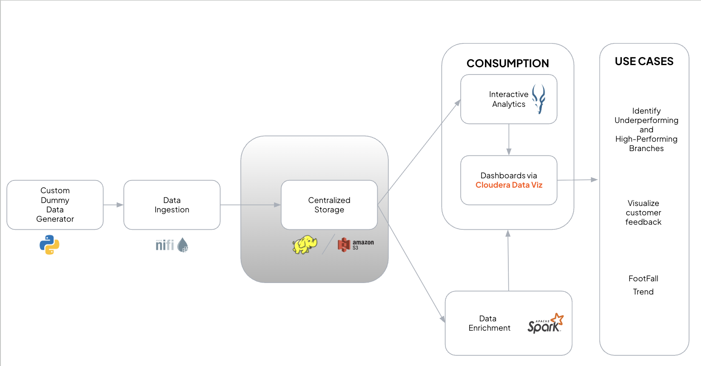

== Steps to Run

=== 1. Clone the Dummy Data Generator Repository

Clone the repository containing the dummy data generators and run the script to start all services:

[source,shell]
----
git clone https://github.com/cloudera/cloudera-partners.git
cd cloudera-partners
git checkout project-axon
cd Project-Axon/On-cloud
----

=== 2. Set Up Python Virtual Environment and Install Dependencies

[source,shell]
----
sudo yum install -y python3 git
python3 -m ensurepip --upgrade
python3 -m venv venv
source venv/bin/activate
pip3 install -r ../assets/requirements.txt

# Verify Flask version
python3 -m flask --version
----

=== 3. Run the application

[source,shell]
----
bash ../assets/run_all.sh
----

- After running the script, verify that the dummy data endpoints are active using a `curl` command.
- Replace `<your-server-ip>` with the public IP of the node where you ran the script.

Example:
[source,shell]
----
curl http://<your-server-ip>:5400/footfall/summary
curl http://<your-server-ip>:8000/campaign-details
----

Sample JSON response from the campaign API:
[source,json]
----
{
  "Budget": 351527.55,
  "CampaignID": 17,
  "CampaignName": "Mclean-Tran Loan Offer",
  "Channel": "Bank Website",
  "EndDate": "2025-07-21",
  "SeasonID": 3,
  "StartDate": "2025-07-14",
  "Status": "Active"
}
----

You should see a JSON response similar to the above.

=== 4. Generate the CDP Workload Password for Your Profile

- Login to the Cloudera Public Cloud Console using your credentials.   
- click your login name at the lower-left corner → *Profile*.  
+
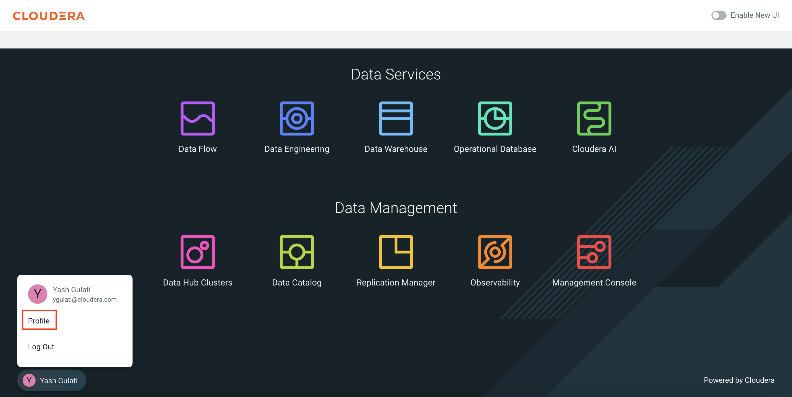
+
- Click *Set Workload Password*.  
- Enter `Changeme123!` (note capital C) or your desired password in both fields and click *Set Workload Password*.  
+
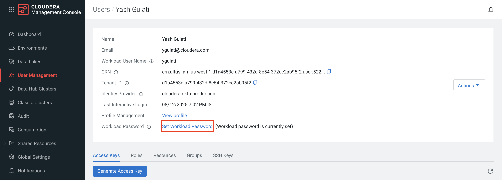
+
- A confirmation message will appear once your password is set successfully — **remember this password, as it will be used in later steps**.

=== 5. Import the NiFi Flow into the Cloudera Flow Management Catalog

. Navigate to the **Cloudera Flow Management** service and open the **Catalog**.
+
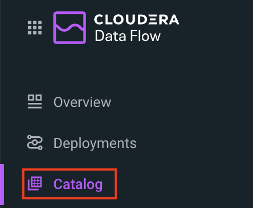
+
. Click on *Import Flow Definition*.
+
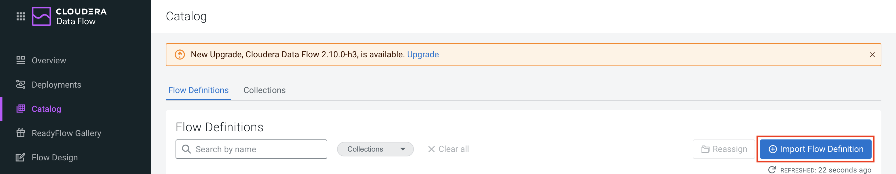
+
. Enter a descriptive name for your flow (for example, `Project-Axon`) and choose the desired collection.
. Upload the `Project-Axon` flow file as the *NiFi Flow Configuration File*, then click *Import*.
+
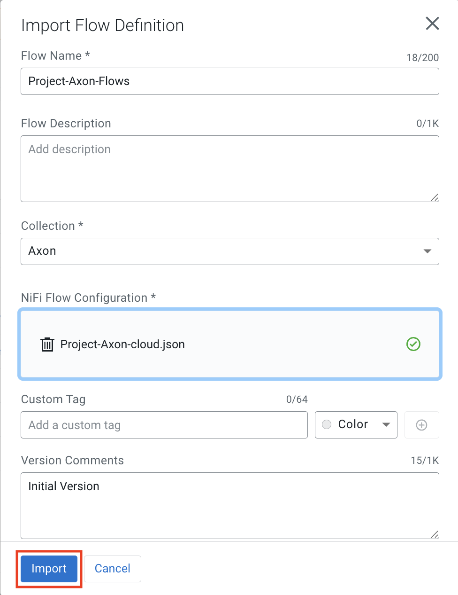
+
. Once the flow appears in the Catalog, click to open it, then select *Deploy* to create a NiFi flow deployment.
+
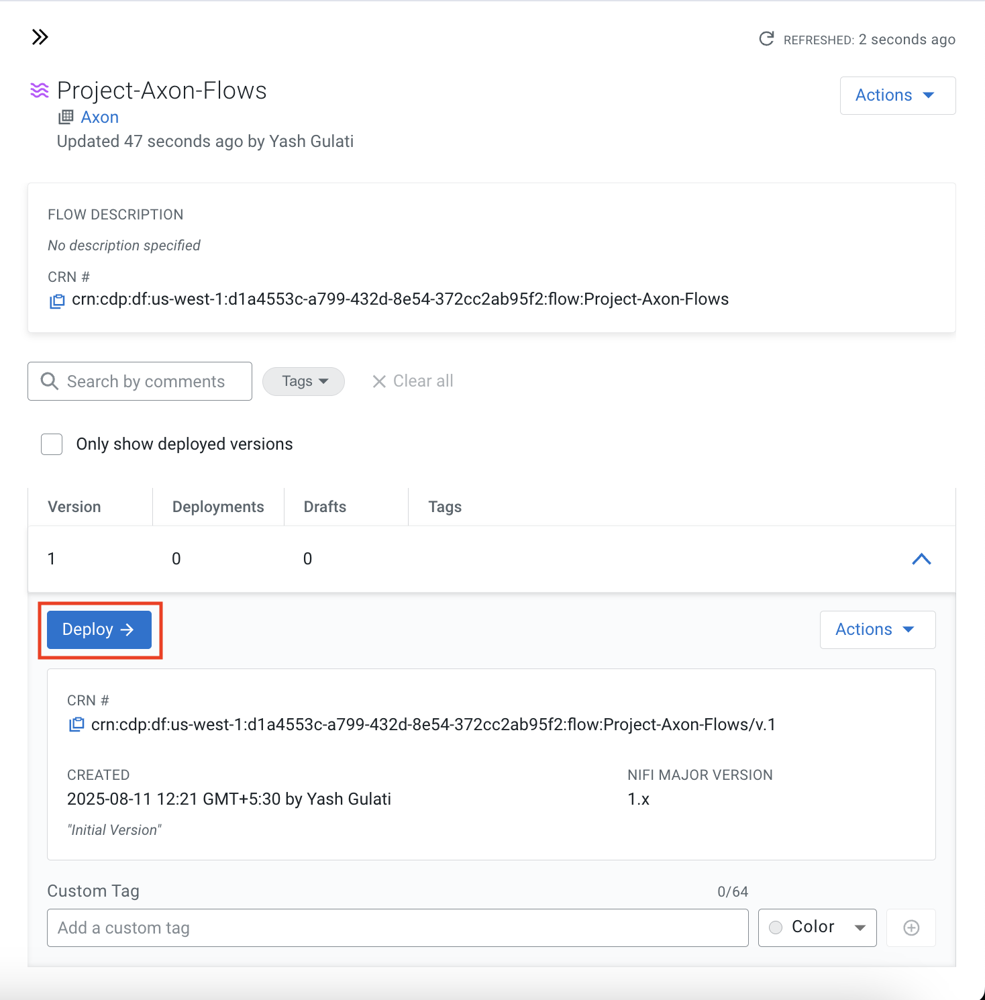

==== Deployment Steps

. In the deployment wizard:
.. Select the target workspace (your Cloudera Public Cloud environment) and click *Continue*.
+
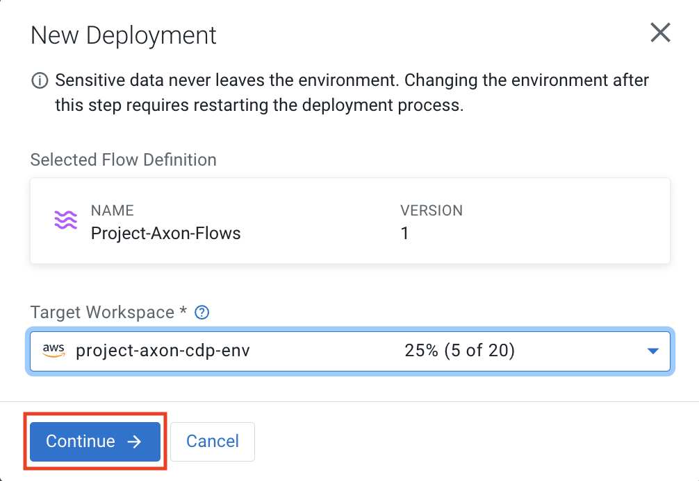
+
.. Provide a name for your deployment, choose the target project, and click *Next*.
.. Under *NiFi Configuration*, keep the default settings and click *Next*.
+
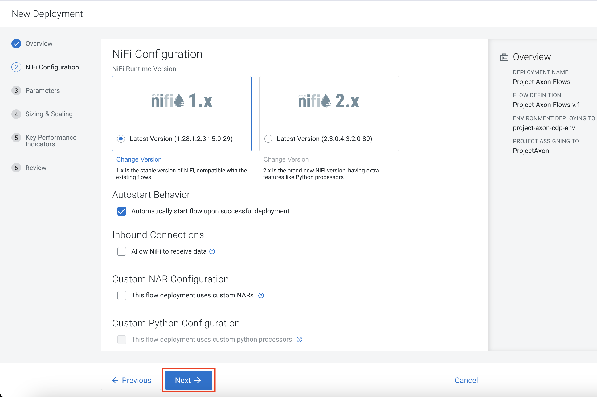
+
.. In the *Parameters* section:
   * Enter your **CDP Workload Username** and **CDP Workload User Password** for your tenant.
   * In the `http url` parameter, update only the IP address portion with the *Public IP address* of the server running your dummy data generator app.
   * Click *Next*.
+
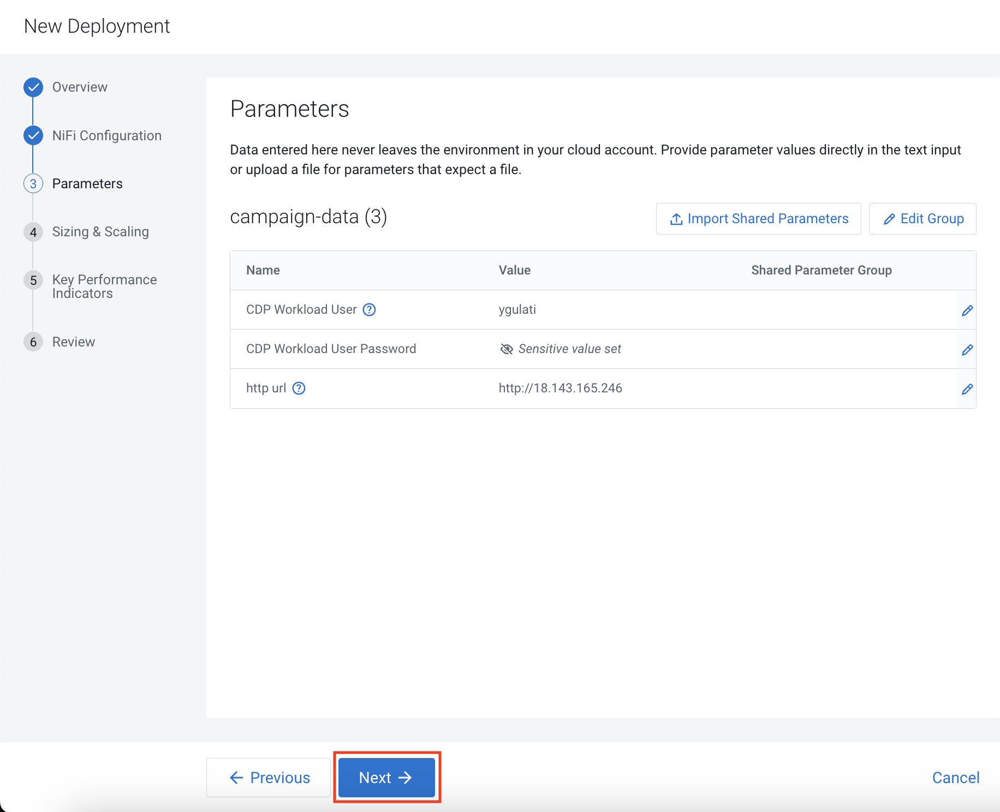
+
.. Under *Sizing and Scaling*, keep the default settings and click *Next*.
.. Leave *Key Performance Indicators (KPIs)* empty unless you wish to define them.
.. Review the configuration and click *Deploy*.
+
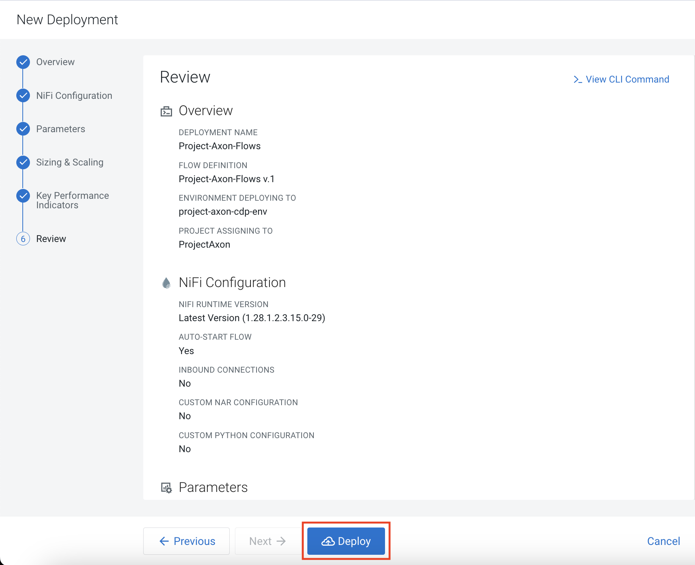
+
. To open and view the deployed flow, go to *Actions* and select *View in NiFi*.
+
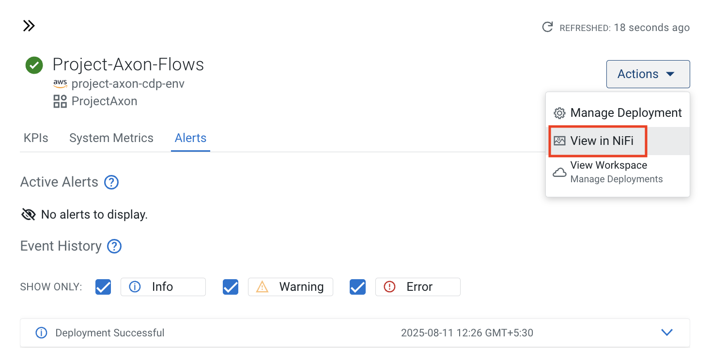
+
. After starting the flow, run it for no more than **5 minutes** to generate about **50–80 flow files**, then right-click the process group and select *Stop* to prevent it from running indefinitely.
+
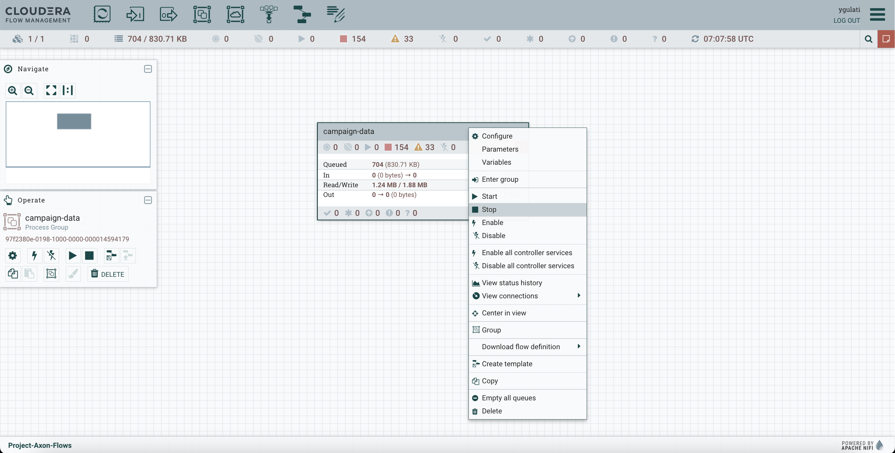

=== 6. Create Hive Tables via Hue

Go to **Cloudera Data Warehouse** and under Virtual warehouses, click on `Hue` for hive virtual warehouse for your environment.

To create all the required databases and tables at once, simply:

- Open the https://github.com/cloudera/cloudera-partners/blob/project-axon/Project-Axon/create_queries.txt[create_queries.txt] file from the cloned folder.
- Copy the entire content.
- Paste it into the Hue Query Editor.
- Select all and click the **Run** button.
+
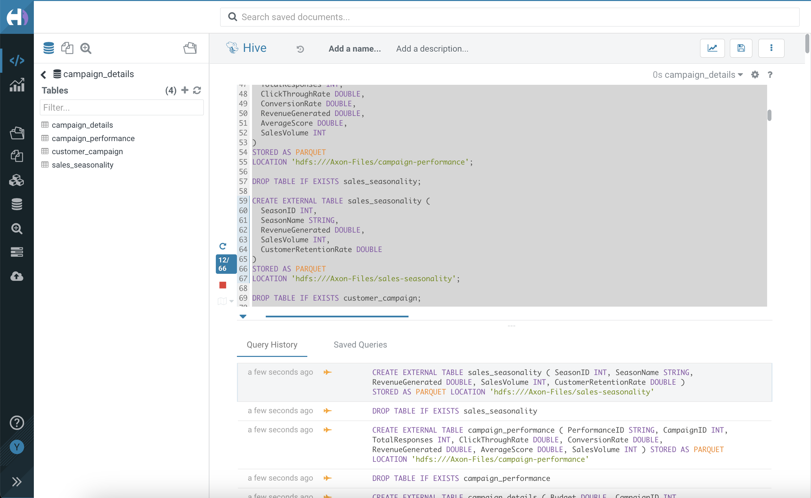

This will create all the necessary Hive tables and databases for the project in one go.

==== 6.1. Verify Table Creation & Data Load

To verify that all tables were successfully created and contain data:

- Copy the content of the file verify_tables.txt — this includes a Hive query to count rows across all expected tables.
- Paste it into the *Hue Query Editor*.
- Click *Run*.

You should see a list of table names with their row counts.

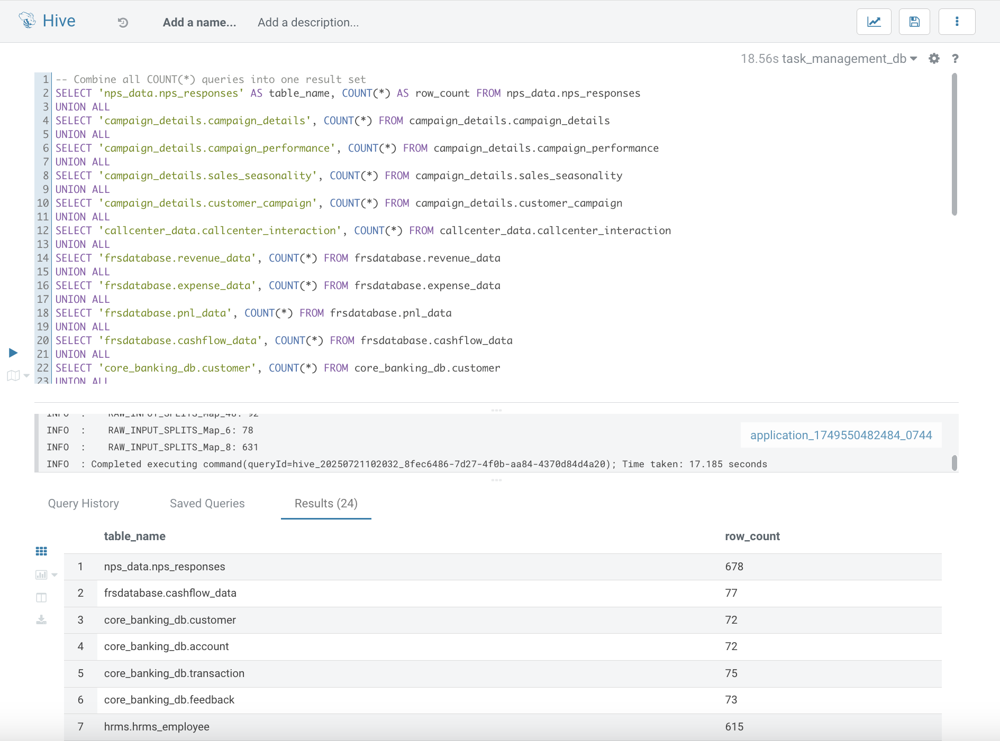

If any table shows a count of `0`, you may need to revisit the data ingestion step for that table.

=== 7. Create a Spark Job using Cloudera Data Engineering (CDE)

In this section, you will create and schedule a Spark job that summarizes call center interactions for each day.

This Spark job:

* Reads data from the `callcenter_interaction` table.
* Aggregates metrics such as resolved calls, unresolved calls, average duration, and average satisfaction rating.
* Appends the summary into the `callcenter_interaction_summary` table for the given date.
* Runs daily on a schedule via CDE.

==== 7.1. Upload Spark Job

. Navigate to *Cloudera Data Engineering* and click on *Jobs* from the side panel.
+
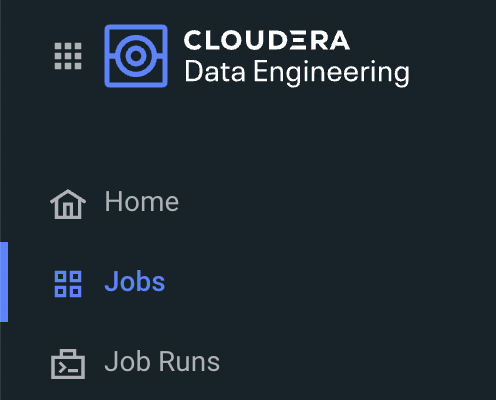
+
. Click on *Create Job* and enter the following values:
+
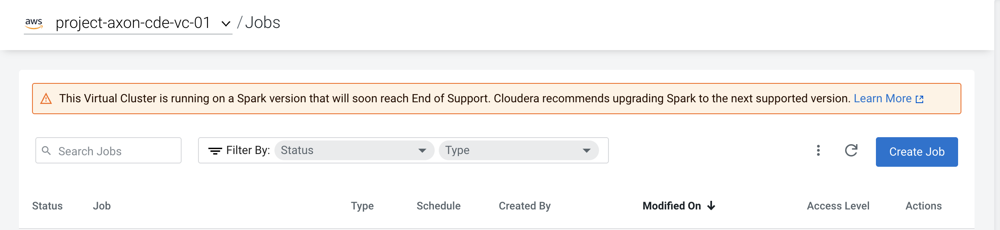
+
.. Select the job type as *Spark*.
.. Give a name to your Spark job (e.g. `CallCenterSummary`).
.. Under *Select Application Files*, upload the `CallCenterSummary.py` file  
   (available in the assets folder on GitHub).
+
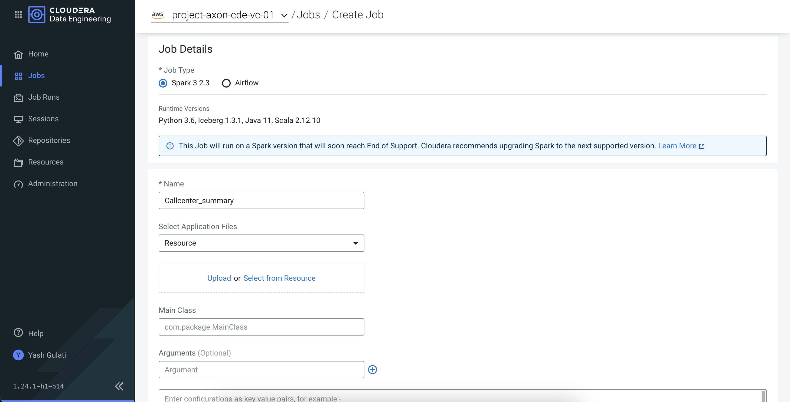
+
. From the *Create and Run* dropdown, click *Create* (do not run it yet).
. The script will automatically create the summary table `callcenter_interaction_summary` if it does not exist.

==== 7.2. Run the Job Manually (Optional)

. Trigger the Spark job once by passing a date argument, for example:
+
----
2025-08-12
----
. Verify that the output is appended to the summary table by running:
+
[source,sql]
----
SELECT * 
FROM callcenter_data.callcenter_interaction_summary
ORDER BY interactiondate DESC;
----

==== 7.3. Create a CDE Airflow DAG

Create an Airflow DAG to orchestrate the daily execution of the `CallCenterSummary.py` Spark job.  
This ensures that the job runs only for unprocessed dates and maintains a record of what has already been processed.

Before creating the DAG, upload the two input files to your S3 bucket with your *desired* values.  
Example files can be found in the `assets` folder:

* `dates_to_run.txt` — contains all interaction dates to be processed.  
* `processed_dates.txt` — keeps track of dates that have already been processed.  

Make sure both files are available in your S3 bucket before proceeding.

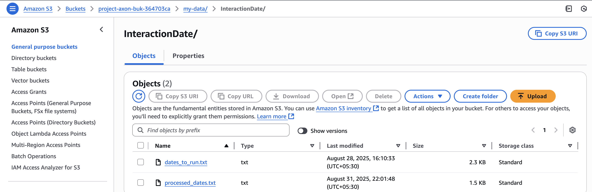

The DAG logic:

* Reads a file `dates_to_run.txt` from S3 containing all interaction dates. 
* Checks against `processed_dates.txt` to determine which dates have already been processed.
* Selects the next unprocessed date and passes it to the Spark job.
* Triggers the Spark job (`CallCenterSummary`) using the `CDEJobRunOperator`.
* Updates the `processed_dates.txt` file on S3 after successful execution.

Steps:

. Go back to the *Jobs* section from the left pane.
. Click on *Create Job* and enter the following parameters:
+

+
.. Select the job type as *Airflow*.
.. Give a name to your job (e.g. `CallCenterSummaryDag`).
.. Before deploying the DAG, update the following variables in the dag file with your project-specific values:

* `S3_BUCKET` → Name of your S3 bucket (example: `project-axon-buk-364703ca`)
* `DATES_FILE` → Path to your interaction dates file (example: `my-data/InteractionDate/dates_to_run.txt`)
* `PROCESSED_FILE` → Path to your processed dates file (example: `my-data/InteractionDate/processed_dates.txt`)
* `SPARK_JOB_NAME` → Name of the Spark job created in Section 7.1 (example: `CallCenterSummary`)
+
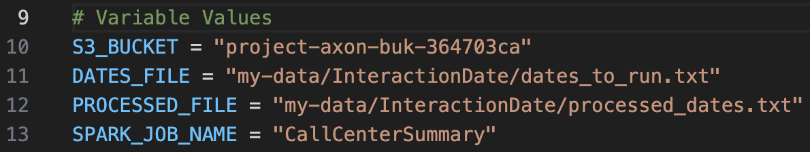
+
.. Upload the DAG file `CallCenterSummary_Dag_job.py`  
   (available in the assets folder).

. From the *Create and Run* dropdown, click *Create* (do not run it yet).
+
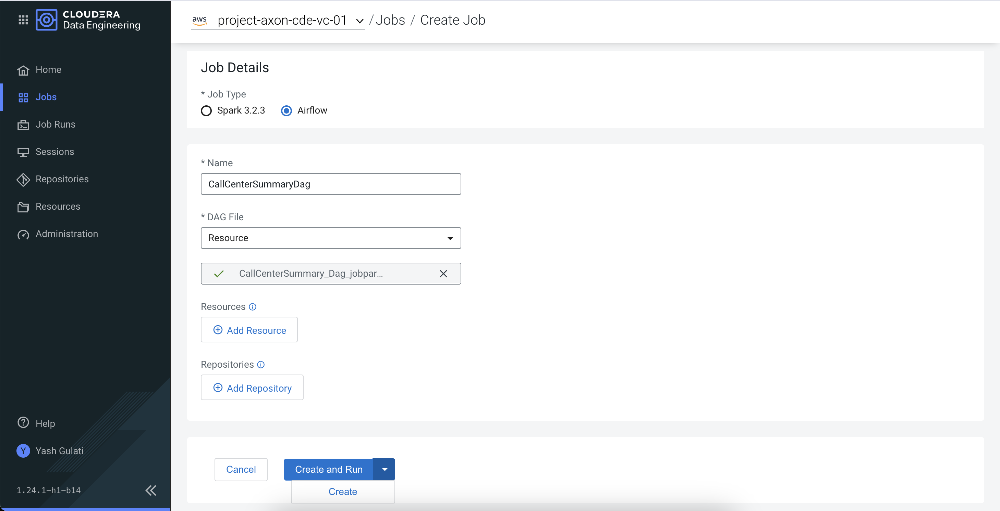
+
. The DAG is scheduled to run daily at `16:30 UTC`.
. Once triggered, the DAG will:
* Identify the next unprocessed interaction date.
* Run the Spark job for that date.
* Update the processed list on S3.

You can view DAG run history and logs in the CDE Airflow UI.

=== 8. Connect Data Visualization to Impala

To enable Data Visualization to read data from Impala, you need to create a connection in the Data Visualization UI. 

While Hive is supported, it is *recommended to use Impala* for creating the connection, as Impala is a high-performance, distributed SQL engine optimized for fast, interactive analytics on large-scale datasets.

- Go to *Cloudera Data Warehouse* and click on Data Visualization and click on your environment name.
+
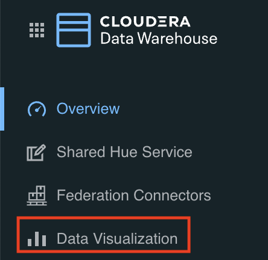
- After getting inside, click on `Open Data Visualization` navigate to the *Data* tab.
+
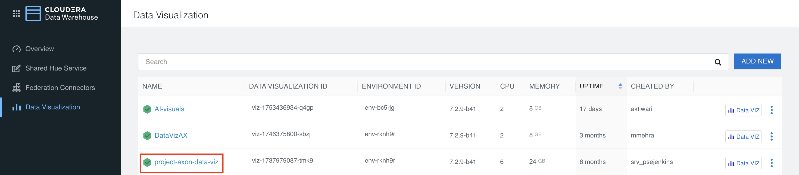
+
- Click *+ New Connection* → *CDW Impala*.
+
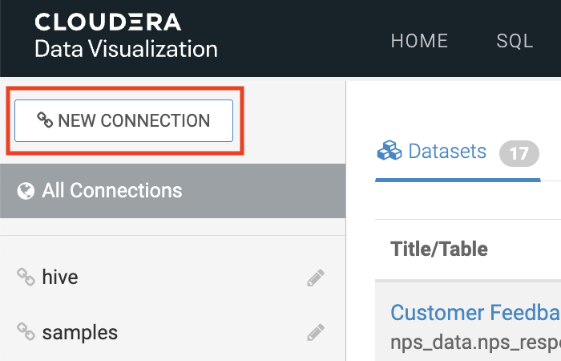
+
[width="90%",cols="40%,50%",options="header"]
|===
|**Parameter** |**Value**
|*Connection Name* |Impala-Axon (or any name you prefer)
|*Connection type* |CDW Impala
|*CDW Warehouse* |Select the name of your Impala Virtual Warehouse
|*Hostname* |It will be auto populated when you select CDW Warehouse
|*Port* |28000 (for Impala)
|*Credentials* |Leave it Empty
|===
+
- Click *Test Connection* to verify.
+
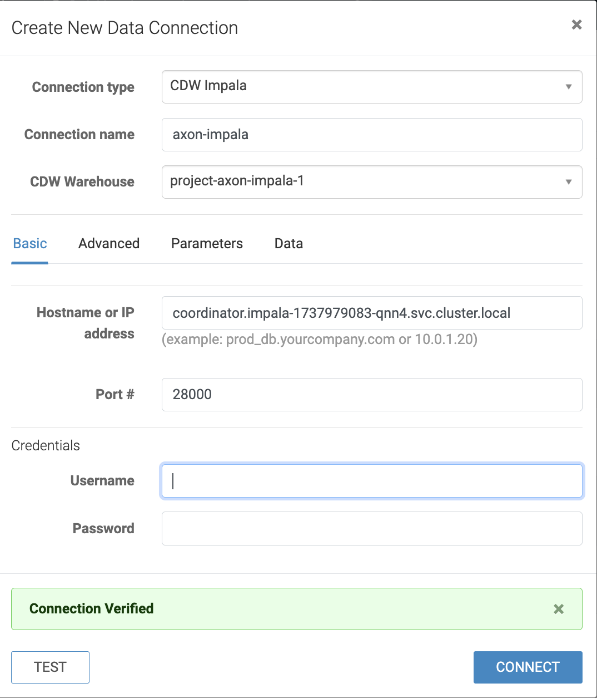
+
- Once successful, click *Save*.
- You can now use this connection to create/import datasets and build/import dashboards from Impala tables.

=== 9. Import Dashboard into Cloudera Data Visualization

- Go to *Cloudera Data Visualization*.

- Navigate to the *Data* tab, then click on *Import visual artifacts*.
+
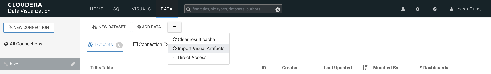
+
- Upload the dashboard JSON file: https://github.com/cloudera/cloudera-partners/blob/project-axon/Project-Axon/project_axon_dashboard.json[project_axon_dashboard.json].
- After uploading, click on *Accept and Import*, you will see an *Import Successful* message along with the list of datasets that were imported as part of the dashboard.
+
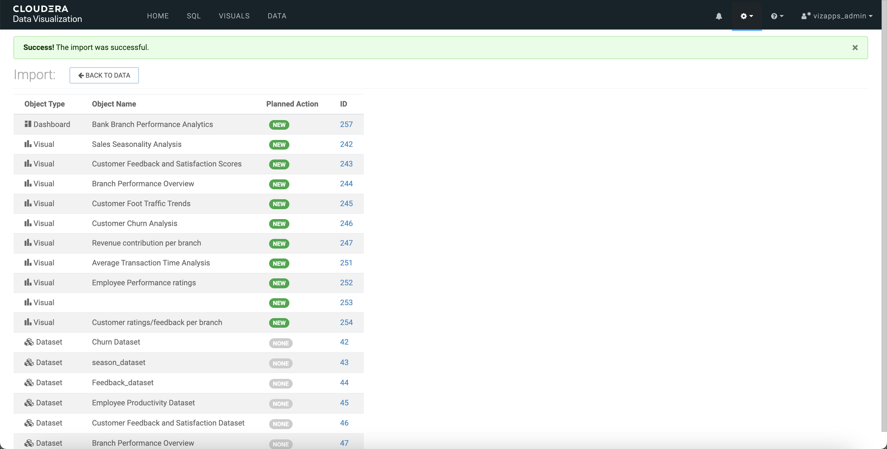
+
- Once imported, navigate to the *Visuals* tab and click on the dashboard to open and view it.
+
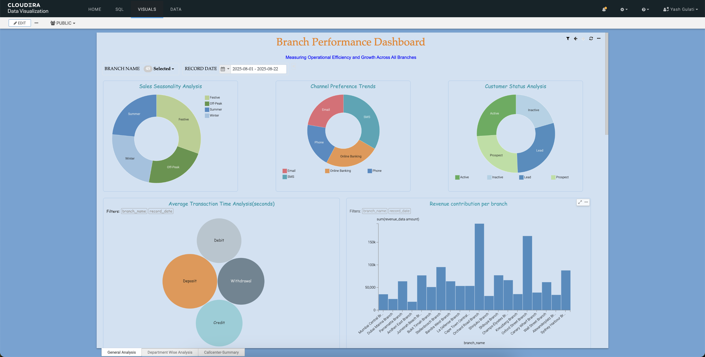

==== 9.1 Explore the *Callcenter-Summary* Dashboard

- As part of the Spark job we ran earlier, records are written into the `callcenter_interaction_summary` table.  
- In the same dashboard, click on the **Callcenter-Summary** tab.  
- This dashboard is directly connected to the `callcenter_interaction_summary` table and provides insights into daily call center interactions.  
- Whenever the Spark job appends new records to the table, you can refresh the dashboard and use the **Date filter** to view visuals for that day.  
+
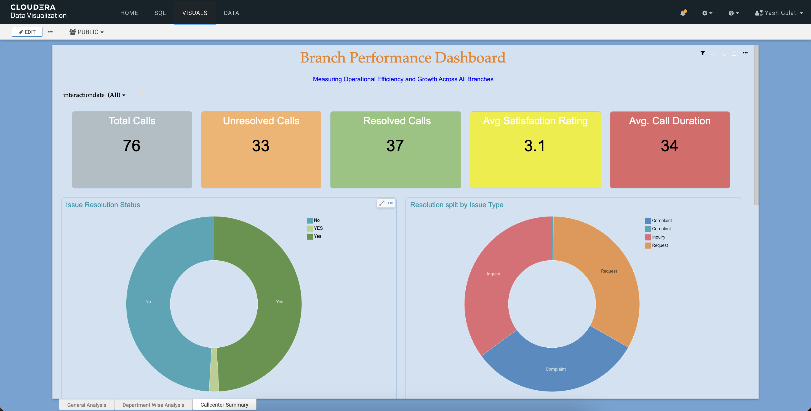

