= Project Axon: Bank Branch Performance Analytics
:author: Yash Gulati
:revdate: 2025-06-20
:toc:
:toclevels: 2

== Introduction

*Project Axon* is a comprehensive end-to-end demonstration of Cloudera’s capabilities across the full data lifecycle — from data ingestion to dashboarding. 

The goal of this project is to help partners:
- Understand how to practically use Cloudera Private Cloud for real-time and batch analytics.
- Identify a relevant and easy-to-explain use case.
- Showcase a ready-to-deploy demo to customers after initial discovery conversations.

**Use Case Chosen:** *Bank Branch Performance Analytics*

This use case helps simulate and analyze the operational performance of various bank branches using dummy data, allowing visual insights via dashboards.

== Prerequisites

=== 1. Linux Server for running Dummy Data Generator App

Ensure you have access to any running **Linux server** for hosting the dummy data generator application. 
A minimal cloud instance like **t3.small** (2 vCPUs, 2 GB RAM) is sufficient for running the application.

==== Required Open Ports
Make sure the following ports are open on the server's firewall or cloud security group:

- 8000
- 8085
- 5001
- 5003
- 5400
- 5500

=== 2. Cloudera Platform Requirements

Ensure you have a running **Cloudera Public Cloud Environment** with the following components:

- Data Lake
- Cloudera Data Flow
- Cloudera Data Warehouse
- Cloudera Data Visualization

This project was developed and tested on the following component versions:

- **Datalake Version**: 7.2.18 
- **Cloudera Data Flow**: 2.10.0-h3-b3  
- **Cloudera Data Warehouse**: 1.10.3-b8
- **Cloudera Data Visualization**: 7.2.9-b41

== Technology Stack

- **Data Generator**: Python (Flask + Faker)
- **Data Ingestion**: Cloudera Data Flow
- **Storage**: S3 (Parquet format)
- **Data Query Layer**: Cloudera Data Warehouse via Hue
- **Visualization**: Cloudera Data Visualization

== Project Workflow

image::../images/project_flow.png[project_flow]

== Steps to Run

=== 1. Clone the Dummy Data Generator Repository

Clone the repository containing the dummy data generators and run the script to start all services:

[source,shell]
----
git clone https://github.com/cloudera/cloudera-partners.git
cd cloudera-partners
git checkout project-axon
cd Project-Axon/On-cloud
----

=== 2. Set Up Python Virtual Environment and Install Dependencies

[source,shell]
----
sudo yum install -y python3 git
python3 -m ensurepip --upgrade
python3 -m venv venv
source venv/bin/activate
pip3 install -r ../assets/requirements.txt

# Verify Flask version
python3 -m flask --version
----

=== 3. Run the application

[source,shell]
----
bash ../assets/run_all.sh
----

- After running the script, verify that the dummy data endpoints are active using a `curl` command.
- Replace `<your-server-ip>` with the public IP of the node where you ran the script.

Example:
[source,shell]
----
curl http://<your-server-ip>:5400/footfall/summary
curl http://<your-server-ip>:8000/campaign-details
----

Sample JSON response from the campaign API:
[source,json]
----
{
  "Budget": 351527.55,
  "CampaignID": 17,
  "CampaignName": "Mclean-Tran Loan Offer",
  "Channel": "Bank Website",
  "EndDate": "2025-07-21",
  "SeasonID": 3,
  "StartDate": "2025-07-14",
  "Status": "Active"
}
----

You should see a JSON response similar to the above.

=== 4. Generate the CDP Workload Password for Your Profile

- Login to the Cloudera Public Cloud Console using your credentials.   
- click your login name at the lower-left corner → *Profile*.  
+
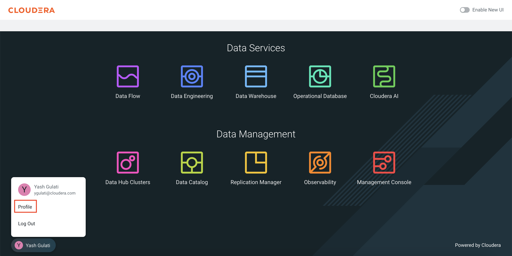
+
- Click *Set Workload Password*.  
- Enter `Changeme123!` (note capital C) or your desired password in both fields and click *Set Workload Password*.  
+
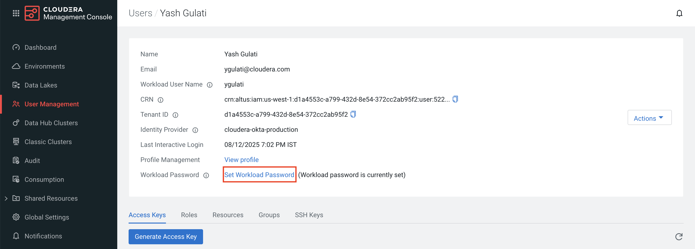
+
- A confirmation message will appear once your password is set successfully — **remember this password, as it will be used in later steps**.

=== 5. Import the NiFi Flow into the Cloudera Flow Management Catalog

. Navigate to the **Cloudera Flow Management** service and open the **Catalog**.
+
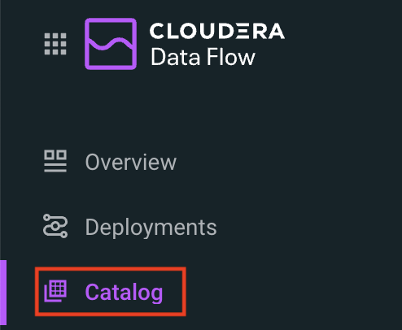
+
. Click on *Import Flow Definition*.
+
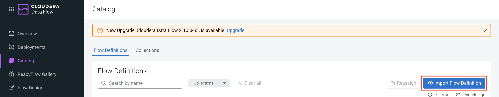
+
. Enter a descriptive name for your flow (for example, `Project-Axon`) and choose the desired collection.
. Upload the `Project-Axon` flow file as the *NiFi Flow Configuration File*, then click *Import*.
+
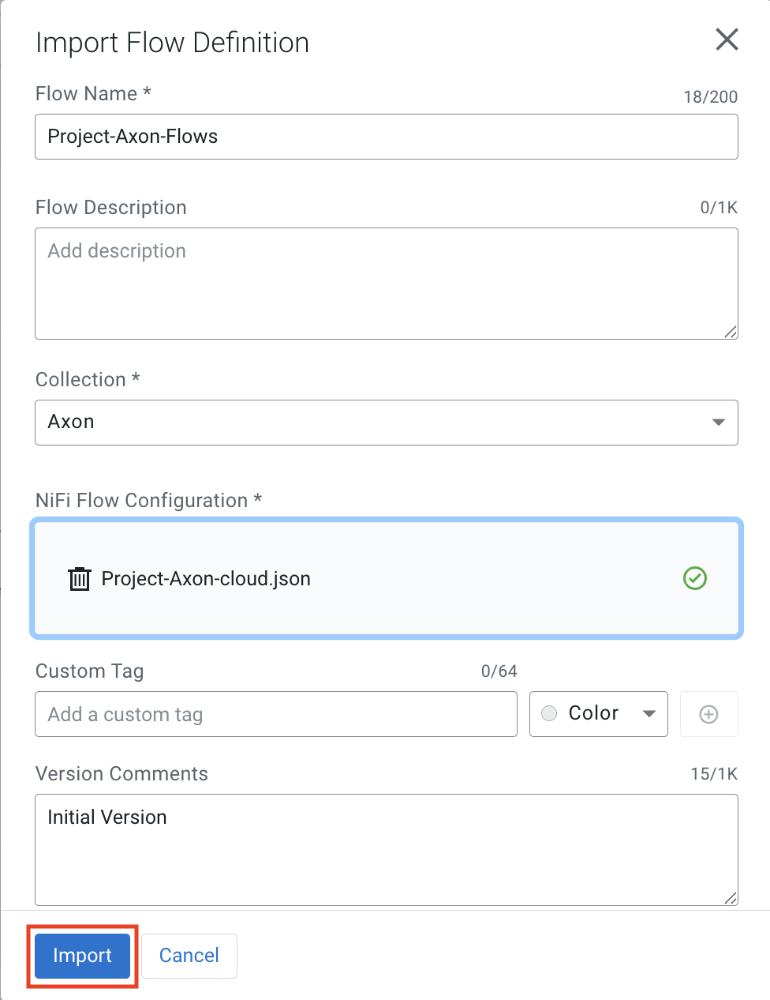
+
. Once the flow appears in the Catalog, click to open it, then select *Deploy* to create a NiFi flow deployment.
+
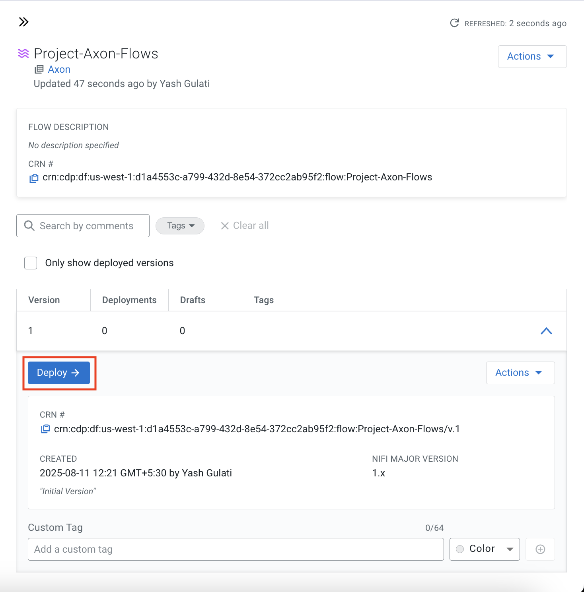

==== Add Ranger Policy for S3 Bucket Access

Before starting the NiFi flows, ensure that a policy is created in Apache Ranger to allow your user to access and send files to the S3 bucket through NiFi processors.

. Go to your environment from the *Management Console* and click on *Ranger*.
. Select the service named *cm_s3*.
. Click on *Add New Policy* and enter the following details:
.. **Policy Name:** e.g. `allow_s3`
.. **Bucket Name:** enter the name of your S3 bucket
.. **Path:** `/*`
.. Under **Allow Conditions**, in the *Users* section add your username to the list.
.. **Permissions:** Select All
.. Click *Save*.
. Next, select the service named *Hadoop SQL*.
. Locate the policy named `9 all - database, table, column`.
. Click on the *Edit* icon to open it.
+
image::../images/dataviz_policy.png[dataviz policy]
+
. In the *Users* section, add your username to the list.
. Scroll down and click *Save*.

==== Deployment Steps

. In the deployment wizard:
.. Select the target workspace (your Cloudera Public Cloud environment) and click *Continue*.
+
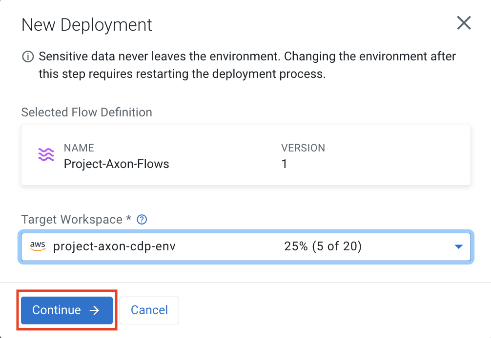
+
.. Provide a name for your deployment, choose the target project, and click *Next*.
.. Under *NiFi Configuration*, keep the default settings and click *Next*.
+
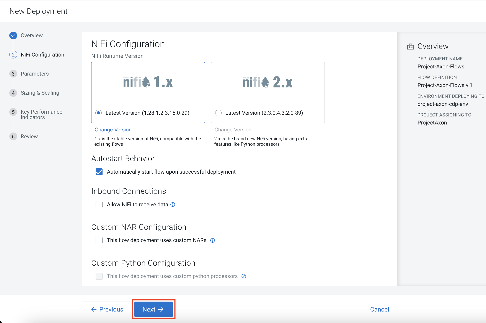
+
.. In the *Parameters* section:
   * Enter your **CDP Workload Username** and **CDP Workload User Password** for your tenant.
   * In the `http url` parameter, update only the IP address portion with the *Public IP address* of the server running your dummy data generator app.
   * Click *Next*.
+
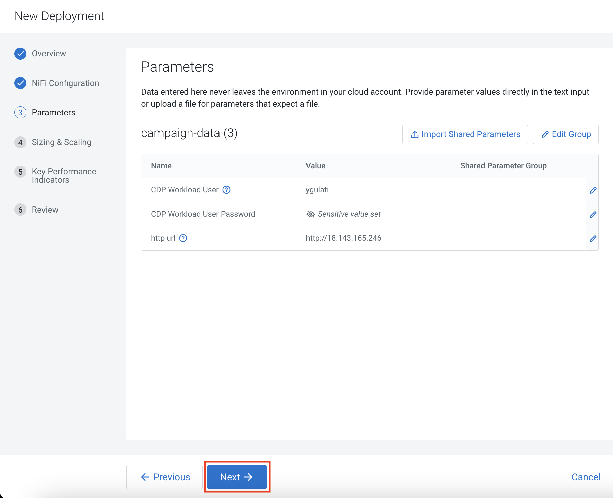
+
.. Under *Sizing and Scaling*, keep the default settings and click *Next*.
.. Leave *Key Performance Indicators (KPIs)* empty unless you wish to define them.
.. Review the configuration and click *Deploy*.
+
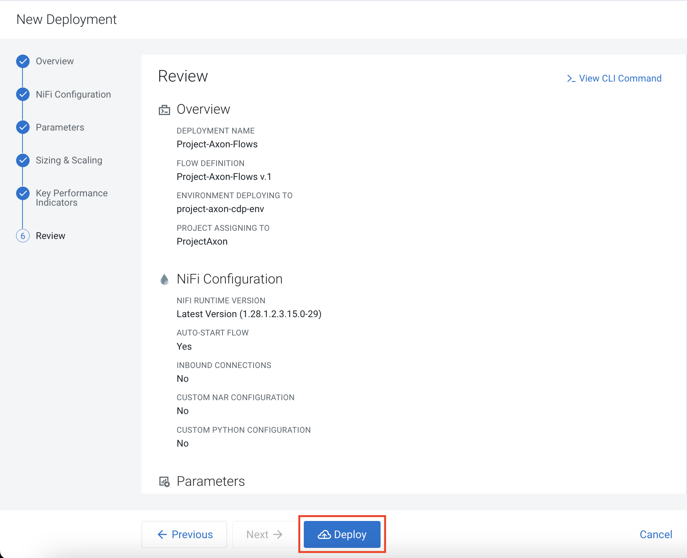
+
. To open and view the deployed flow, go to *Actions* and select *View in NiFi*.
+
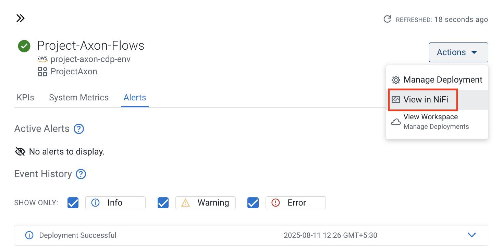
+
. After starting the flow, run it for no more than **5 minutes** to generate about **50–80 flow files**, then right-click the process group and select *Stop* to prevent it from running indefinitely.
+
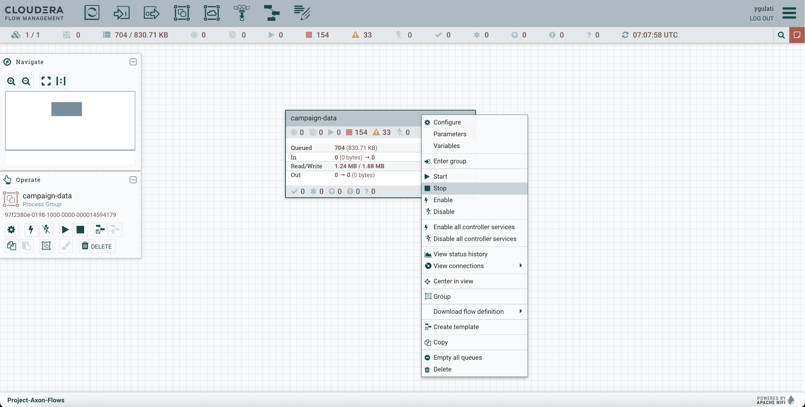

=== 6. Create Hive Tables via Hue

Go to **Cloudera Data Warehouse** and under Virtual warehouses, click on `Hue` for hive virtual warehouse for your environment.

To create all the required databases and tables at once, simply:

- Open the 'create_queries_cloud.txt' file from the cloned folder.
- Copy the entire content.
- Paste it into the Hue Query Editor.
- Select all and click the **Run** button.
+
image::../images/hive_queries.png[hive_queries, width=800, height=500]

This will create all the necessary Hive tables and databases for the project in one go.

==== 6.1. Verify Table Creation & Data Load

To verify that all tables were successfully created and contain data:

- Copy the content of the file verify_tables.txt — this includes a Hive query to count rows across all expected tables.
- Paste it into the *Hue Query Editor*.
- Click *Run*.

You should see a list of table names with their row counts.

image::../images/table_verify.png[tables verify]

If any table shows a count of `0`, you may need to revisit the data ingestion step for that table.

=== 6.2. Integrate Hue SQL AI Assistant (Optional)

Follow the steps below to integrate the Hue SQL AI Assistant with Amazon Bedrock. While there are multiple ways to integrate the Hue SQL AI Assistant, this demo uses Amazon Bedrock.

==== Prerequisites
- Access to the AWS Management Console
- Permissions to use Amazon Bedrock and IAM
- Cloudera Data Warehouse with a running Hive Virtual Warehouse

==== Steps

. Log in to the AWS Management Console and navigate to the *Amazon Bedrock* service.

. In the left navigation pane, click *API keys*.
.. Under *Long-term API keys*, click *Generate long-term API key*.
+
image::../images/bedrock_create_apikey.png[bedrock_access_key]
+
.. Set the expiration date and generate the key.
+
image::../images/apikey_generate.png[apikey_generate]
+
.. Make a note of the generated API key.

. Navigate to the *IAM* service.
.. Go to *Users* and search for the user named `BedrockAPIKey-xxxx`.
.. Select the user and click *Create access key*.
+
image::../images/bedrock_access_key.png[bedrock_access_key]
+
.. Copy the *Access Key ID* and *Secret Access Key*.
+
These credentials will be used by Hue to access Amazon Bedrock.

. Go to the *Cloudera Data Warehouse* service.
.. Click the three-dot menu next to the *Hive Virtual Warehouse* and select *Edit*.
+
image::../images/hive_vw_edit.png[hive_vw_edity]
+
.. Navigate to the *Configurations* tab.
.. Select *Hue* from the left panel.

. From the *Configuration files* dropdown, select `hue-safety-valve`.

. Remove any existing content and paste the following configuration, replacing the placeholders with your values:
+
[source,ini]
----
[aws]
[[aws_accounts]]
[[[default]]]
access_key_id=<AWS_ACCOUNT_ACCESS_KEY_ID>
secret_access_key=<AWS_ACCOUNT_SECRET_ACCESS_KEY>
region=<AWS_REGION>

[[bedrock_account]]
access_key_id=<BEDROCK_USER_ACCESS_KEY_ID>
secret_access_key=<BEDROCK_USER_SECRET_ACCESS_KEY>
region=<AWS_REGION>

[desktop]
[[ai_interface]]
service='bedrock'
model='claude3'
----
+
. Click *Apply* and wait for the Virtual Warehouse to update.
+
image::../images/hue_safety_valve.png[hue_safety_valve]
+
. When you open Hue, the AI Assistant bar is visible at the top, allowing you to generate, explain, and optimize queries.
+
image::../images/hue_assistant.png[hue_assistant]

=== 7. Create a Spark Job using Cloudera Data Engineering (CDE)

In this section, you will create and schedule a Spark job that summarizes call center interactions for each day.

This Spark job:

* Reads data from the `callcenter_interaction` table.
* Aggregates metrics such as resolved calls, unresolved calls, average duration, and average satisfaction rating.
* Appends the summary into the `callcenter_interaction_summary` table for the given date.
* Runs daily on a schedule via CDE.

==== 7.1. Upload Spark Job

. Navigate to *Cloudera Data Engineering* and click on *Jobs* from the side panel.
+
image::../images/cde.png[cde, width=300, height=300]
+
. Click on *Create Job* and enter the following values:
+
image::../images/create_job.png[creating job]
+
.. Select the job type as *Spark*.
.. Give a name to your Spark job (e.g. `CallCenterSummary`).
.. Under *Select Application Files*, upload the `CallCenterSummary.py` file  
   (available in the assets folder on GitHub).
.. In the arguments section, enter `{{ interaction_date }}` in the box.
+
image::../images/spark_job.png[creating spark job]
+
. From the *Create and Run* dropdown, click *Create* (do not run it yet).
. The script will automatically create the summary table `callcenter_interaction_summary` if it does not exist.

==== 7.2. Run the Job Manually (Optional)

. Trigger the Spark job once by passing a date argument, for example:
+
----
2025-08-12
----
. Verify that the output is appended to the summary table by running:
+
[source,sql]
----
SELECT * 
FROM callcenter_data.callcenter_interaction_summary
ORDER BY interactiondate DESC;
----

==== 7.3. Create an Airflow Connection

. Navigate to the *Virtual Cluster Details* page and click on *Airflow UI*.
+
image::../images/vc_details_page.png[vc_details_page]
+
. In the top navigation bar, go to *Admin* → *Connections* to create a new connection.
+
image::../images/airflow_connection.png[airflow_connection]
+
. On the Connections page, click on the *+* icon to create a new connection.
+
image::../images/add_airflow_con.png[add_airflow_con]
+
. Fill in the following details:

.. *Connection ID*: `aws_default`
.. *Connection Type*: *Amazon Web Services*
.. *AWS Access Key ID*: Enter the Access Key ID of your AWS account.
.. *AWS Secret Access Key*: Enter the Secret Access Key of your AWS account.

. Click on *Test* to validate the connection.
. Once the test passes, click *Save*.
+
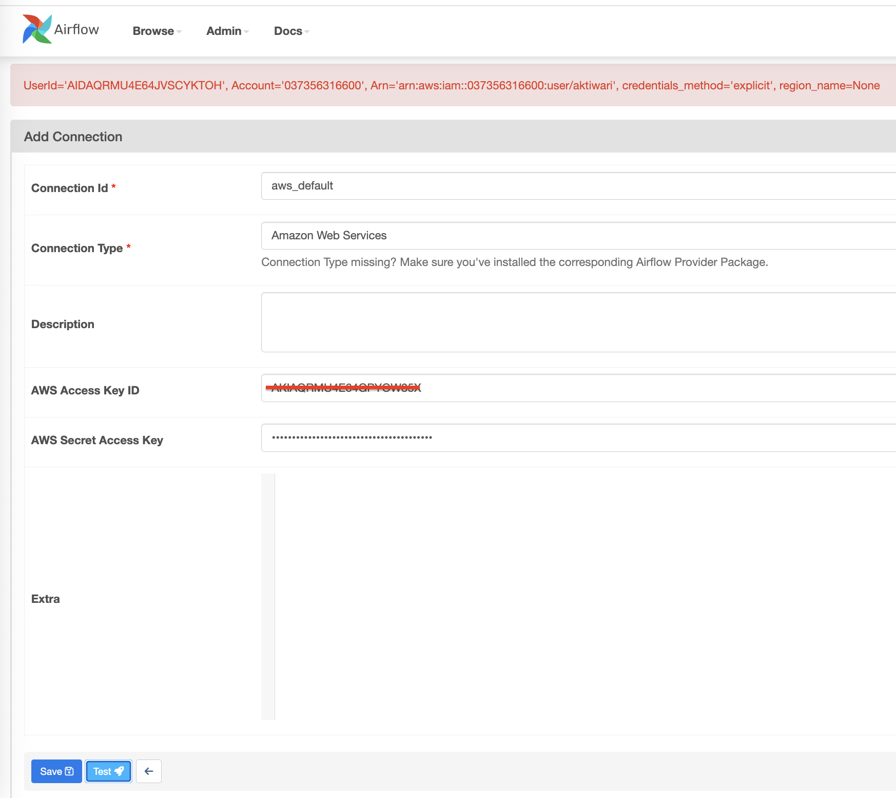

==== 7.4. Create a CDE Airflow DAG

Create an Airflow DAG to orchestrate the daily execution of the `CallCenterSummary.py` Spark job.  
This ensures that the job runs only for unprocessed dates and maintains a record of what has already been processed.

Before creating the DAG, upload the two input files to your S3 bucket.  
Example files can be found in the `assets` folder:

* `dates_to_run.txt` — should contain all the dates available in the `callcenter_interaction` table. Make sure the dates listed here match exactly with the ones already present in the table.  
* `processed_dates.txt` — keeps track of dates that have already been processed.  

Make sure both files are available in your S3 bucket before proceeding.

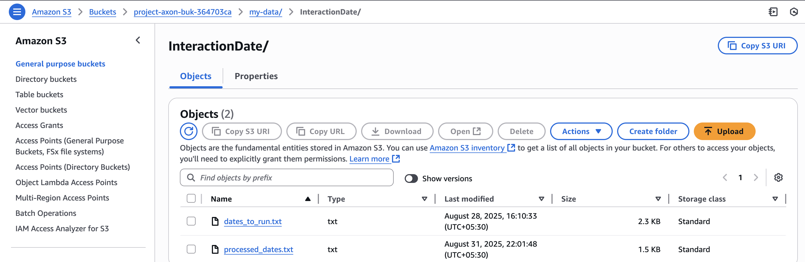

The DAG logic:

* Reads a file `dates_to_run.txt` from S3 containing all interaction dates. 
* Checks against `processed_dates.txt` to determine which dates have already been processed.
* Selects the next unprocessed date and passes it to the Spark job.
* Triggers the Spark job (`CallCenterSummary`) using the `CDEJobRunOperator`.
* Updates the `processed_dates.txt` file on S3 after successful execution.

Steps:

. Go back to the *Jobs* section from the left pane.
. Click on *Create Job* and enter the following parameters:
+
image::../images/create_job.png[Creating jobs]
+
.. Select the job type as *Airflow*.
.. Give a name to your job (e.g. `CallCenterSummaryDag`).
.. Before deploying the DAG, update the following variables in the dag file with your project-specific values:

* `S3_BUCKET` → Name of your S3 bucket (example: `project-axon-buk-364703ca`)
* `DATES_FILE` → Path to your interaction dates file (example: `my-data/InteractionDate/dates_to_run.txt`)
* `PROCESSED_FILE` → Path to your processed dates file (example: `my-data/InteractionDate/processed_dates.txt`)
* `SPARK_JOB_NAME` → Name of the Spark job created in Section 7.1 (example: `CallCenterSummary`)
+
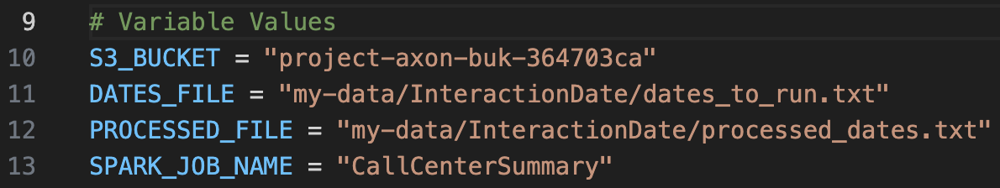
+
.. Upload the DAG file `CallCenterSummary_Dag_job.py`  
   (available in the assets folder).

. From the *Create and Run* dropdown, click *Create* (do not run it yet).
+
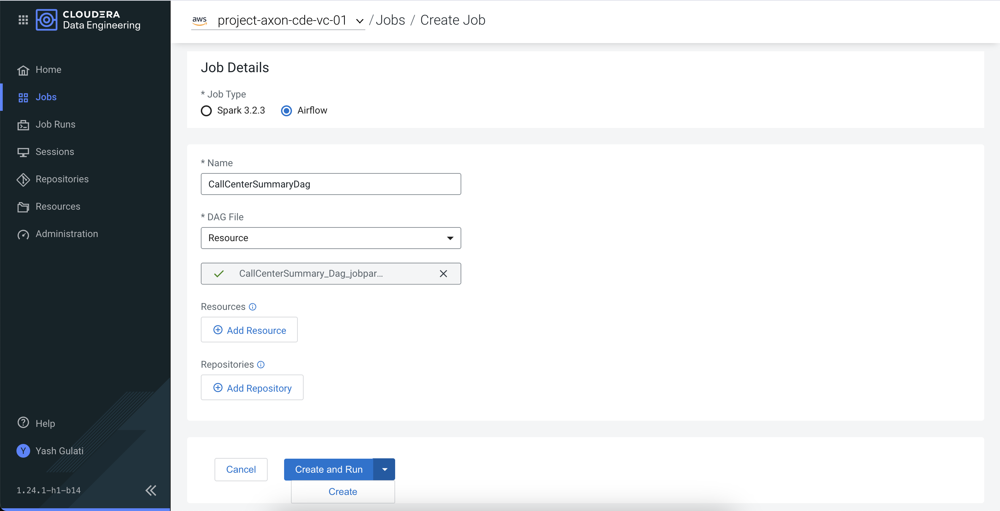
+
. The DAG is scheduled to run daily at `16:30 UTC`.
. Once triggered, the DAG will:
* Identify the next unprocessed interaction date.
* Run the Spark job for that date.
* Update the processed list on S3.

You can view DAG run history and logs in the CDE Airflow UI.

=== 8. Connect Data Visualization to Impala

To enable Data Visualization to read data from Impala, you need to create a connection in the Data Visualization UI. 

While Hive is supported, it is *recommended to use Impala* for creating the connection, as Impala is a high-performance, distributed SQL engine optimized for fast, interactive analytics on large-scale datasets.

- Go to *Cloudera Data Warehouse* and click on Data Visualization and click on your environment name.
+
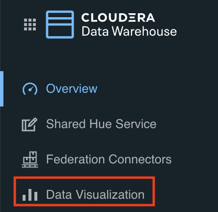
- After getting inside, click on `Open Data Visualization` navigate to the *Data* tab.
+
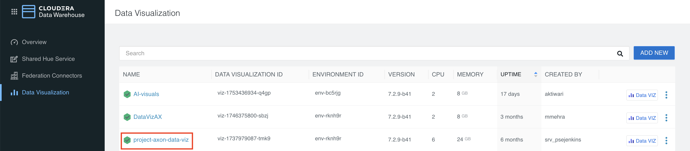
+
- Click *+ New Connection* → *CDW Impala*.
+
image::../images/connection.png[make connection, width=500, height=300]
+
[width="90%",cols="40%,50%",options="header"]
|===
|**Parameter** |**Value**
|*Connection Name* |Impala-Axon (or any name you prefer)
|*Connection type* |CDW Impala
|*CDW Warehouse* |Select the name of your Impala Virtual Warehouse
|*Hostname* |It will be auto populated when you select CDW Warehouse
|*Port* |28000 (for Impala)
|*Credentials* |Leave it Empty
|===
+
- Click *Test Connection* to verify.
+
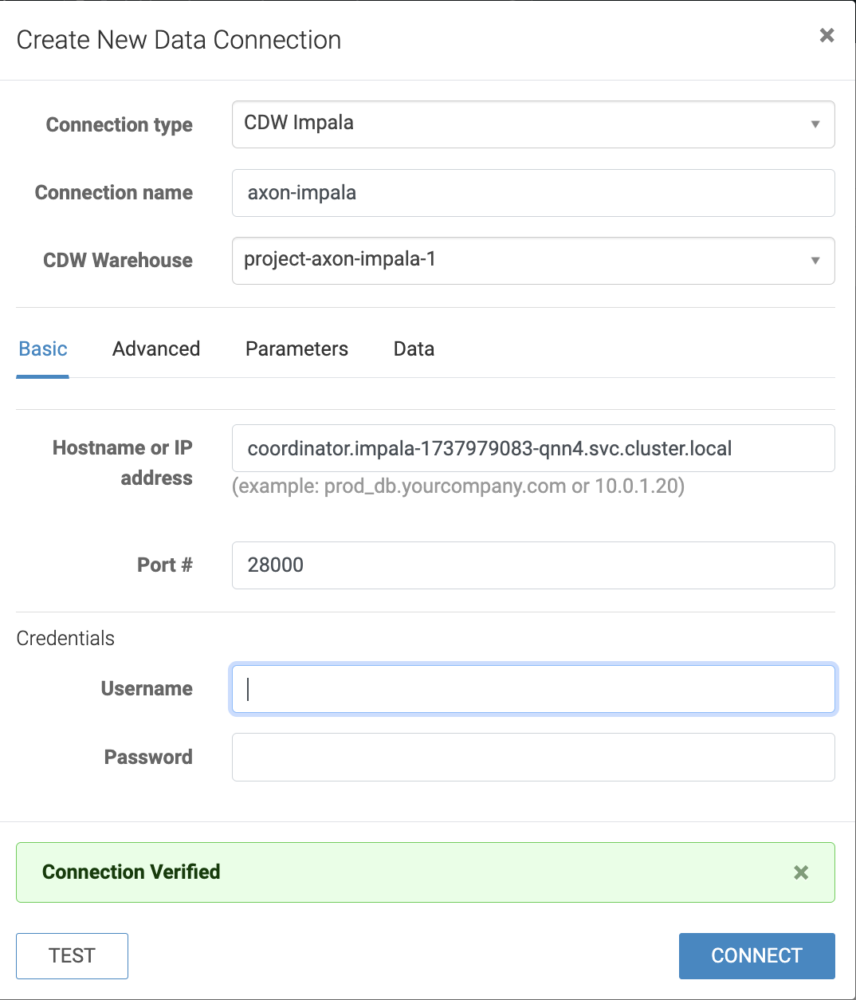
+
- Once successful, click *Save*.
- You can now use this connection to create/import datasets and build/import dashboards from Impala tables.

=== 9. Import Dashboard into Cloudera Data Visualization

- Go to *Cloudera Data Visualization*.

- Navigate to the *Data* tab, then click on *Import visual artifacts*.
+
image::../images/import_visual.png[Import Visual]
+
- Upload the dashboard JSON file: https://github.com/cloudera/End2EndLabs/blob/main/Project-Axon/assets/project_axon_dashboard.json[project_axon_dashboard.json].
- After uploading, click on *Accept and Import*, you will see an *Import Successful* message along with the list of datasets that were imported as part of the dashboard.
+
image::../images/dashboard_import_verify.png[import success, width=800, height=450]
+
- Once imported, navigate to the *Visuals* tab and click on the dashboard to open and view it.
+
image::../images/dashboard.png[dashboard]

==== 9.1 Explore the *Callcenter-Summary* Dashboard

- As part of the Spark job we ran earlier, records are written into the `callcenter_interaction_summary` table.  
- In the same dashboard, click on the **Callcenter-Summary** tab.  
- This dashboard is directly connected to the `callcenter_interaction_summary` table and provides insights into daily call center interactions.  
- Whenever the Spark job appends new records to the table, you can refresh the dashboard and use the **Date filter** to view visuals for that day.  
+
image::../images/callcenter_dashboard.png[Callcenter Summary Dashboard, width=800, height=450]

=== 10. Integrate AI Assistant in Cloudera Data Visualization (Optional)

This section describes how to integrate the AI Assistant in Cloudera Data Visualization using a model hosted on Cloudera AI Inference.

Alternatively, the AI Assistant can also be integrated using external model providers such as OpenAI or Amazon Bedrock. For more details on configuring external model providers, click https://docs.cloudera.com/data-visualization/8/howto-manage-site-settings/topics/viz-site-settings-ai-config.html[here].

==== Prerequisites

Before proceeding, ensure the following prerequisites are met:

* You have administrator access to the Cloudera Data Visualization service.
* A model is deployed using Cloudera AI Inference, and a model endpoint has been created.
** Example model: Qwen/Qwen2.5-7B-Instruct

==== Configuration Steps

. Navigate to the Cloudera Data Visualization service from either:
* The Base Cluster, or
* The Cloudera Data Warehouse service

. Click the *Settings* (gear) icon and select *Site Settings*.
+
image::../images/site_settings.png[site_settings, width=800, height=450]
+
. Under *AI Settings*, select *Completion*, then click *Create Profile*.
+
image::../images/create_profile.png[create_profile, width=800, height=450]
+
. Enter the following details to create a completion profile:
+
* *Name*: Enter a name for the AI model profile.
* *Engine*: Select *Cloudera AI Inference* from the drop-down list.
* *API Key*: Enter the CDP Token associated with the deployed model endpoint.
* *Service URL*: Enter the base URL of the model endpoint from the Cloudera AI Registry.
* *Model*: Enter the name of the deployed model.

. Click *Test* to validate the configuration.
+
image::../images/verify_profile.png[verify_profile, width=400, height=450]
+
. Once the profile status shows *Profile Verified*, click *Save* to complete the setup.

==== Creating an AI Visual

This section describes how to create and use an AI Visual in Cloudera Data Visualization.

. Import the https://github.com/cloudera/End2EndLabs/blob/main/Project-Axon/assets/AI_Visual.json[`AI_Visual.json`] to add the AI Visual dashboard to Cloudera Data Visualization, following the same process used in the earlier steps.
+
. In the AI Visual input box, enter prompts to interact with your dataset.  
  The AI Visual enables conversational querying over the selected dataset.
+
.Example AI Visual Prompts
[cols="2,3", options="header"]
|===
| Example Prompt | Visual Updated

| What is the count of the transactions and total revenue in the East and West regions?
| Revenue by Region

| Show the sum of transaction amounts by transaction type for Credit and Withdrawal
| Amount by Transaction Type

| Show the total revenue for records dated in 2023 and 2024
| Total Revenue by Date
|===
+
image::../images/ai_visual.png[ai_visual, width=700, height=450]
+
. Once the AI Visual generates a response, click the *Share* icon and select *Share Parameters*.
  This allows the generated parameters to update other visuals in the dashboard, if applicable.
+
image::../images/share_parameters.png[share_parameters, width=700, height=450]
+
NOTE: The parameters referenced by the AI Visual must match the parameters used in the corresponding visuals for them to update correctly.
+
image::../images/updated_visual.png[updated_visual, width=700, height=450]
+
. You can create multiple AI model profiles, as described in the previous section, and dynamically switch between them using the AI Visual settings.
+
image::../images/change_profile.png[change_profile, width=700, height=450]
+
. You can also provide custom SQL generation instructions within the AI Visual settings to control how queries are generated.

==== Result

The AI Visual allows users to explore data conversationally and dynamically drive other dashboard visuals using shared parameters.

