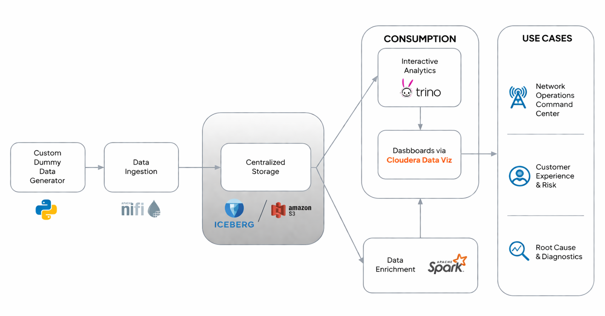

= Real-Time Telecom Network Quality Monitoring Demo
:toc:
:toclevels: 3

== 1. Introduction

This demo demonstrates an end-to-end real-time data pipeline for monitoring telecom network quality and customer experience.

The solution simulates telecom call events, ingests them using a streaming pipeline, enriches them with customer data, computes real-time KPIs, and visualizes insights through dashboards.

The goal is to show how network issues can be detected and analysed in near real time.

---

== 2. Architecture Overview

---

== 3. Data Flow Summary

1. Synthetic telecom call data is generated.
2. NiFi ingests data and writes it to S3 in Parquet format.
3. Spark enrichment job processes new data and adds customer and quality attributes.
4. Spark KPI job computes aggregated metrics in time windows.
5. Iceberg tables store both detailed and aggregated data.
6. Dashboards visualize the results in near real time.

---

== 4. Pre-Demo Setup

Ensure the following before starting the demo:

- All streaming jobs are stopped
- NiFi flow is stopped
- Iceberg tables are created
- Checkpoints are cleared (if schema changes were made)
- Dashboard is configured and accessible

Optional validation:

----
SELECT COUNT(*) FROM telco_fact.cdr_enriched;
SELECT COUNT(*) FROM telco_fact.kpi_network_quality;
----

---

== 5. Demo Steps

=== Step 1: Verify Initial State

Run the following queries to confirm no new data is being processed:

----
SELECT COUNT(*) FROM telco_fact.cdr_enriched;
SELECT COUNT(*) FROM telco_fact.kpi_network_quality;
----

At this stage, the system is idle and no streaming data is flowing.

---

=== Step 2: Start Enrichment Streaming Job

Start the Spark enrichment job.

This job continuously monitors the incoming data and enriches it with customer attributes and derived fields such as experience score and network quality.

Allow a few seconds for the job to initialize.

---

=== Step 3: Start KPI Streaming Job

Start the KPI aggregation job.

This job performs window-based aggregations on the enriched data and computes network KPIs such as total calls, dropped calls, drop rate percentage, and signal quality.

---

=== Step 4: Start NiFi Flow

Start the NiFi ingestion flow.

This begins the generation and ingestion of real-time telecom call data into the system.

---

=== Step 5: Observe Enriched Data

Execute the following queries to observe data being enriched in real time:

----
SELECT COUNT(*) FROM telco_fact.cdr_enriched;
----

----
SELECT *
FROM telco_fact.cdr_enriched
ORDER BY event_ts DESC
LIMIT 5;
----

You should see the record count increasing and new enriched records appearing continuously.

---

=== Step 6: Observe KPI Data

After a short delay (typically 20–40 seconds), run:

----
SELECT *
FROM telco_fact.kpi_network_quality
ORDER BY window_start DESC
LIMIT 5;
----

This shows aggregated KPIs being computed in real time.

---

=== Step 7: View Dashboard

Open the dashboard in Cloudera Data Visualization.

Verify the following:

- KPI tiles showing drop rate percentage and signal quality
- Time-series charts displaying trends over time
- Tower-level comparison of network performance

The dashboard updates automatically as new data arrives.

---

=== Step 8: Demonstrate Live Behavior (Optional)

Stop the NiFi flow and observe that the metrics stabilize.

Restart the NiFi flow and observe that the dashboard updates resume.

---

== 6. Key Observations

- Data is processed incrementally without full table scans
- KPIs are computed continuously using streaming aggregation
- The system responds quickly to incoming data
- Insights are available almost immediately after data ingestion

---

== 7. Recommended Configuration for Demo

- Window duration: 1 minute
- Watermark: 1 minute
- Trigger interval: 10 seconds

These settings ensure fast feedback suitable for demonstration purposes.

---

== 8. Common Issues and Considerations

- Ensure only one version of each streaming job is running
- Clear checkpoint directories after schema changes
- Avoid large window sizes that delay KPI output
- Ensure sufficient cluster resources for parallel jobs

---

== 10. Conclusion

This demo illustrates how a real-time data platform can be used to monitor telecom network performance, detect issues quickly, and provide actionable insights for improving customer experience.