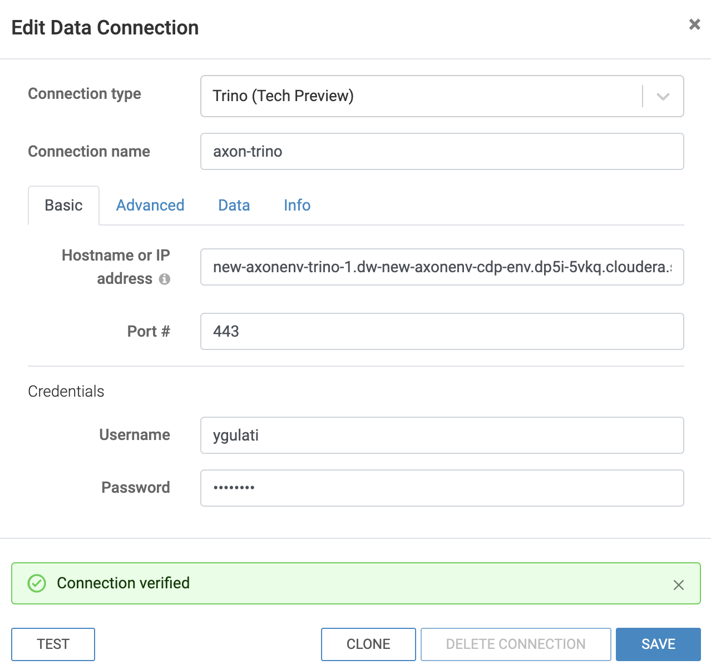
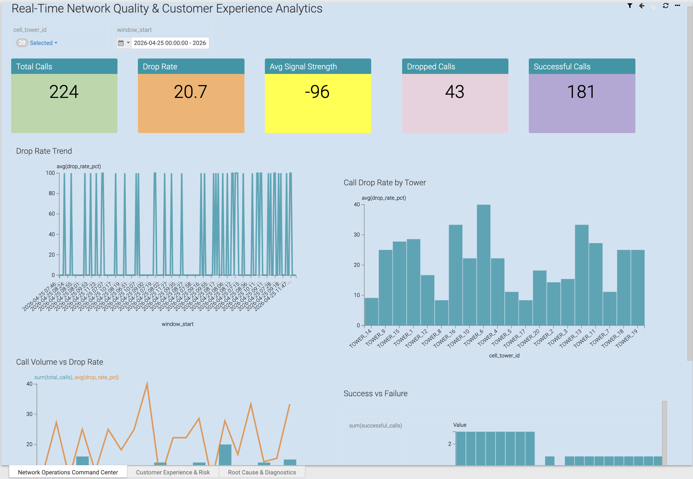

= Project Axon: Real-Time Network Quality & Customer Experience Analytics
:author: Avanish Tiwari
:revdate: 2026-04-07
:toc:
:toclevels: 2

== Introduction

*Project Axon* is a comprehensive end-to-end demonstration of Cloudera’s capabilities across the full data lifecycle — from data ingestion to dashboarding. 

The goal of this project is to help partners:
- Understand how to practically use Cloudera Private Cloud for real-time and batch analytics.
- Identify a relevant and easy-to-explain use case.
- Showcase a ready-to-deploy demo to customers after initial discovery conversations.

**Use Case Chosen:** *Real-Time Network Quality & Customer Experience Analytics*

This usecase demonstrates an end-to-end real-time data pipeline for monitoring telecom network quality and customer experience.

The solution simulates telecom call events, ingests them using a streaming pipeline, enriches them with customer data, computes real-time KPIs, and visualizes insights through dashboards.

The goal is to show how network issues can be detected and analysed in near real time.

== Prerequisites

=== 1. Linux Server for running Dummy Data Generator App

Ensure you have access to any running **Linux server** for hosting the dummy data generator application. 
A minimal cloud instance like **t3.small** (2 vCPUs, 2 GB RAM) is sufficient for running the application.

==== Required Open Ports
Make sure the following ports are open on the server's firewall or cloud security group:

- 9000

=== 2. Cloudera Platform Requirements

Ensure you have a running **Cloudera Public Cloud Environment** with the following components:

- Data Lake
- Cloudera Data Flow
- Cloudera Data Engineering
- Cloudera Data Warehouse
- Cloudera Data Visualization

This project was developed and tested on the following component versions:

- **Datalake Version**: 7.3.1
- **Cloudera Data Flow**: 2.10.0-h3-b3 
- **Cloudera Data Engineering**: 1.10.0-b8 
- **Cloudera Data Warehouse**: 1.10.3-b8
- **Cloudera Data Visualization**: 7.2.9-b41

== Technology Stack

- **Data Generator**: Python (Flask)
- **Data Ingestion**: Cloudera Data Flow
- **Storage**: S3 (parquet format)
- **Data Query Layer**: Trino via Cloudera Data Warehouse
- **Visualization**: Cloudera Data Visualization

== Project Workflow

image::../images/Telco_project_flow.png[project_flow]

== Steps to Run

=== 1. Clone the Dummy Data Generator Repository

Clone the repository containing the dummy data generators and run the script to start all services:

[source,shell]
----
sudo yum install -y python3 git
git clone https://github.com/cloudera/End2EndLabs.git
cd End2EndLabs/Project-Axon/assets
----

=== 2. Set Up Python Virtual Environment and Install Dependencies

[source,shell]
----
python3 -m ensurepip --upgrade
python3 -m venv venv
source venv/bin/activate
pip3 install -r requirements.txt

# Verify Flask version
python3 -m flask --version
----

=== 3. Run the application

[source,shell]
----
bash run_telco.sh
----

- After running the script, verify that the dummy data endpoints are active using a `curl` command.
- Replace `<your-server-ip>` with the public IP of the node where you ran the script.

Example:
[source,shell]
----
curl http://<your-server-ip>:9000/cdr
----

Sample JSON response from the campaign API:
[source,json]
----
{
  "call_result":"SUCCESS",
  "caller_id":"352-1127",
  "cell_tower_id":"TOWER_16",
  "duration":14,
  "event_id":"568f911b-8b3f-4698-b00f-0b1526907cac",
  "receiver_id":"368-6174",
  "signal_strength":-91,
  "timestamp":"2026-04-07T13:57:12.886299"
}
----

You should see a JSON response similar to the above.

=== 4. Generate the CDP Workload Password for Your Profile

- Login to the Cloudera Public Cloud Console using your credentials.   
- click your login name at the lower-left corner → *Profile*.  
+
image::../images/profile_name.png[profile name]
+
- Click *Set Workload Password*.  
- Enter `Changeme123!` (note capital C) or your desired password in both fields and click *Set Workload Password*.  
+
image::../images/set_workload.png[set_workload]
+
- A confirmation message will appear once your password is set successfully — **remember this password, as it will be used in later steps**.

=== 5. Import the NiFi Flow into the Cloudera Flow Management Catalog

. Navigate to the **Cloudera Flow Management** service and open the **Catalog**.
+
image::../images/cloudera_data_flow.png[cloudera data flow, width=300, height=300]
+
. Click on *Import Flow Definition*.
+
image::../images/import_catalog.png[import catalog]
+
. Enter a descriptive name for your flow (for example, `Project-Axon`) and choose the desired collection.
. Upload the link:../On-cloud/Project-Axon-cloud-Telco.json[** `Project-Axon-cloud-Telco`**] flow file as the *NiFi Flow Configuration File*, then click *Import*.
+
image::../images/import_wizard.png[import wizard, width=400, height=500]
+
. Once the flow appears in the Catalog, click to open it, then select *Deploy* to create a NiFi flow deployment.
+
image::../images/deploy_flow.png[deploy flow, width=500, height=800]

==== Add Ranger Policy for S3 Bucket Access

Before starting the NiFi flows, ensure that a policy is created in Apache Ranger to allow your user to access and send files to the S3 bucket through NiFi processors.

. Go to your environment from the *Management Console* and click on *Ranger*.
. Select the service named *cm_s3*.
. Click on *Add New Policy* and enter the following details:
.. **Policy Name:** e.g. `allow_s3`
.. **Bucket Name:** enter the name of your S3 bucket
.. **Path:** `/*`
.. Under **Allow Conditions**, in the *Users* section add your username to the list.
.. **Permissions:** Select All
.. Click *Save*.
. Next, select the service named *Hadoop SQL*.
. Locate the policy named `9 all - database, table, column`.
. Click on the *Edit* icon to open it.
+
image::../images/dataviz_policy.png[dataviz policy]
+
. In the *Users* section, add your username to the list.
. Scroll down and click *Save*.

==== Deployment Steps

. In the deployment wizard:
.. Select the target workspace (your Cloudera Public Cloud environment) and click *Continue*.
+
image::../images/deploy_target_env.png[deploy target env, width=450, height=600]
+
.. Provide a name for your deployment, choose the target project, and click *Next*.
.. Under *NiFi Configuration*, keep the default settings and click *Next*.
+
image::../images/nifi_configuration.png[NiFi Configuration, width=700, height=900]
+
.. In the *Parameters* section:
   * Enter your **CDP Workload Username** and **CDP Workload User Password** for your tenant.
   * In the `http url` parameter, update only the IP address portion with the *Public IP address* of the server running your dummy data generator app.
   * Click *Next*.
+
image::../images/update_parameters.png[Update Parameters, width=600, height=900]
+
.. Under *Sizing and Scaling*, keep the default settings and click *Next*.
.. Leave *Key Performance Indicators (KPIs)* empty unless you wish to define them.
.. Review the configuration and click *Deploy*.
+
image::../images/review_wizard.png[review wizard, width=600, height=700]
+
. To open and view the deployed flow, go to *Actions* and select *View in NiFi*.
+
image::../images/view_in_nifi.png[view in nifi, width=500, height=900]
+
. After starting the flow, run it for **5-10 minutes** to generate a few flow files, then right-click the process group and select *Stop* to prevent it from running indefinitely.
+
image::../images/stop_flow.png[stop flow]

=== 6. Create an external table `cdr_raw` against the S3 bucket using Cloudera data explorer(HUE)
[source,shell]
----
CREATE DATABASE IF NOT EXISTS telco_facts;
USE telco_facts;

DROP TABLE IF EXISTS cdr_raw;
CREATE EXTERNAL TABLE cdr_raw (
    call_result STRING,
    caller_id STRING,
    cell_tower_id STRING,
    duration BIGINT,
    event_id STRING,
    receiver_id STRING,
    signal_strength BIGINT,
    `timestamp` STRING
)
STORED AS PARQUET
LOCATION 's3a://${s3_bucket_name}/user/${user_name}/telco-usecase/cdr-data/';
----

=== 7. Create & Enrich Iceberg Tables via spark jobs in Cloudera Data Engineering

In this section, you will create and run Spark jobs that create some iceberg tables and perform some enrichments/aggregations on the raw data ingested into the `cdr_raw` table by the NiFi flow.

These Spark jobs:

* Creates a new table customer_profile with the available static dataset of customers and their profiles.
* Creates two iceberg tables `cdr_enriched` & `kpi_network_quality` with a one time job run.
* Combines the cdr_raw table with customer_profiles to create a more enriched dataset in the `cdr_enriched` table with streaming job.
* Agregates metrics such as dropped calls, experience scores, network quality, and high risk customers in cdr_enriched.

* **cdr_enrichment_backfill** This is a one-time batch job that performs the initial enrichment of the raw CDR data by joining it with the customer_profiles table. It populates the `cdr_enriched` table with enriched records, including customer details and calculated fields such as experience scores and risk levels.

* Agregates the enriched data with streaming job `kpi_network_quality` to create a summary of network kpis such as drop rate, success rate, avg_signal_strength, signal_quality.

[NOTE]
====
The first two jobs that create the iceberg tables and perform the initial enrichment can be run as one-time batch jobs. However, the last two jobs that perform the streaming enrichments and aggregations should ideally be set up as streaming jobs that run continuously to keep the data updated in near real-time.

For the demo purposes, you can choose to run the streaming jobs first and then trigger the nifi flow to see the data flowing through and updating the tables in real-time. Alternatively, you can run the streaming jobs after the NiFi flow to see the initial batch of data getting processed and enriched in one go.
====

==== 7.1. Create and Run the Spark Job to create `customer_profiles`
As the first step, you will upload the static customer dataset in S3 and create a Spark job in Cloudera Data Engineering to read that dataset and create an iceberg table `customer_profiles`.

===== Upload the customer dataset `customer.csv` to s3 bucket
Make sure to upload the link:../assets/customer.csv[**`customer.csv`**] file (available in the assets folder) to your S3 bucket at `<bucket_name>/data/CDR-Data/customer.csv` before proceeding.

===== Create and Run the Spark Job `customer_profile_load`
. Navigate to *Cloudera Data Engineering* and click on *Jobs* from the side panel.
+
image::../images/cde.png[cde, width=300, height=300]
+
. Click on *Create Job* and enter the following values:
+
image::../images/create_job.png[creating job]
+
.. Select the job type as *Spark*.
.. Give a name to your Spark job (e.g. `customer_profile_load`).
.. Update the bucket name in the script with your actual S3 bucket name where `input_path` is defined.
   For example, change `s3a://new-axonenv-buk-9b441e31/data/CDR-Data/customer.csv` to `s3a://your-bucket-name/data/CDR-Data/customer.csv`.
.. Under *Select Application Files*, upload the `customer_profile_load.py` file  
   (available in the assets folder on GitHub).
+
image::../images/spark_job.png[creating spark job]
+
. click *Create and Run*.
. The script will create table `customer_profile` in the `telco_dim` database with the customer profile data read from the csv file.
. Verify that the output is appended to the summary table by running:
+
[source,sql]
----
USE telco_dim;
SHOW TABLES;
----

==== 7.2. Create and Run the Spark Job to create `cdr_enriched` and `kpi_network_quality` tables
. Navigate to *Cloudera Data Engineering* and click on *Jobs* from the side panel.
+
image::../images/cde.png[cde, width=300, height=300]
+
. Click on *Create Job* and enter the following values:
+
image::../images/create_job.png[creating job]
+
.. Select the job type as *Spark*.
.. Give a name to your Spark job (e.g. `create_iceberg_tables`).
.. Under *Select Application Files*, upload the `create_iceberg_tables.py` file  
   (available in the assets folder on GitHub).
. click *Create and Run*.
. The script will create two iceberg tables `cdr_enriched` and `kpi_network_quality` in the `telco_facts` database.
. Verify that the tables are created by running:
+
[source,sql]
----
USE telco_facts;
SHOW TABLES;
----

==== 7.3. Create the Spark Job to perform streaming enrichment and aggregation in the `cdr_enriched` and `kpi_network_quality` tables

. Create another Spark job in Cloudera Data Engineering with the following details:
+
image::../images/create_job.png[creating job]
+
.. Select the job type as *Spark*.
.. Give a name to your Spark job (e.g. `cdr_enrichment_streaming`).
.. Update the `bucket_name` and `username` in the script for `input_path` and `checkpoint_path` with your actual S3 `bucket_name` and `username`.
   For example:
[source,shell]
   ----
   input_path = "s3a://<your-bucket-name>/user/<your-username>/telco-usecase/cdr-data"
   checkpoint_path = "s3a://<your-bucket-name>/user/<your-username>/telco-usecase/checkpoints/cdr-enriched/"
   ----

.. Under *Select Application Files*, upload the `cdr_enrichment_streaming.py` file  
   (available in the assets folder on GitHub).
..  Click *Create* (do not run it yet, we will trigger this job before a demo for live demonstration).

. Similarly, create another Spark job for the kpi aggregation with the `kpi_network_quality_streaming.py` file.
.. Give a name to your Spark job (e.g. `kpi_network_quality_streaming`).
.. Update the `bucket_name` and `username` in the script for `checkpoint_path` with your actual S3 `bucket_name` and `username`.
   For example:
[source,shell]
   ----
   checkpoint_path = "s3a://<your-bucket-name>/user/<your-username>/telco-usecase/checkpoints/kpi-network-quality/"
   ----
.. Under *Select Application Files*, upload the `kpi_network_quality_streaming.py` file
    (available in the assets folder on GitHub).
..  Click *Create* (do not run it yet, we will trigger this job before a demo for live demonstration).

=== 8. Connect Data Visualization to Trino

To enable Data Visualization to read data from Trino, you need to create a connection in the Data Visualization UI. 

While Hive/impala is supported, it is *recommended to use Trino* for establishing the connection, as Trino enables fast, interactive analytics and can query data across multiple heterogeneous data sources through a federated architecture.

- Go to *Cloudera Data Warehouse* and click on Data Visualization and click on your environment name.
+
image::../images/cloudera_data_warehouse.png[cloudera data warehouse, width=300, height=300]
- After getting inside, click on `Open Data Visualization` navigate to the *Data* tab.
+
image::../images/cdw_dataviz.png[tables verify]
+
- Click *+ New Connection* → *Trino*.
+
image::../images/connection.png[make connection, width=500, height=300]
+
[width="90%",cols="40%,50%",options="header"]
|===
|**Parameter** |**Value**
|*Connection Name* |Trino-Axon (or any name you prefer)
|*Connection type* |Trino
|*Hostname* |The hostname of the Trino coordinator, click on trino virtual warehouse and copy the trino url and extract the hostname from there. It should be in the format `trino-coordinator-xxxx-xxxxxx.abcde.cloudera.site` (Remove the `https://` prefix and the port number suffix if present to get the hostname).
|*Port* |443 (for Trino)
|*Credentials* |provide your CDP username and the workload password.
|===
+
- Click *Test Connection* to verify.
+

+
- Once successful, click *Save*.
- You can now use this connection to create/import datasets and build/import dashboards from iceberg tables.

=== 9. Import Dashboard into Cloudera Data Visualization

- Go to *Cloudera Data Visualization*.

- Navigate to the *Data* tab, then click on *Import visual artifacts*.
+
image::../images/import_visual.png[Import Visual]
+
- Upload the dashboard JSON file: https://github.com/cloudera/End2EndLabs/blob/main/Project-Axon/assets/Telco_project_axon_dashboard.json[Telco_project_axon_dashboard.json].
- After uploading, click on *Accept and Import*, you will see an *Import Successful* message along with the list of datasets that were imported as part of the dashboard.
+
image::../images/dashboard_import_verify.png[import success, width=800, height=450]
+
- Once imported, navigate to the *Visuals* tab and click on the dashboard to open and view it.
+

==== 9.1 Explore the *Real-Time Network Quality & Customer Experience Analytics* Dashboard

- As part of the streaming job , records are added into the `kpi_network_quality` and `cdr_enriched` tables.  
- In the same dashboard, you can switch between different visualizations `Network Operations Command Center`, `Customer Experience & Risk`, `Root Cause & Diagnostics`

- This dashboard is directly connected to the `kpi_network_quality` table and provides real-time insights into the network quality and customer experience metrics.
- As soon as a new data is available via NiFi flow into S3 bucket, streaming jobs add records to the table, and you can refresh the dashboard and use the **window_start filter** to view visuals for that time period.  

