= Project Axon: Bank Branch Performance Analytics
:author: Yash Gulati
:revdate: 2025-06-20
:toc:
:toclevels: 2

== Introduction

*Project Axon* is a comprehensive end-to-end demonstration of Cloudera’s capabilities across the full data lifecycle — from data ingestion to dashboarding. 

The goal of this project is to help partners:
- Understand how to practically use Cloudera Private Cloud for real-time and batch analytics.
- Identify a relevant and easy-to-explain use case.
- Showcase a ready-to-deploy demo to customers after initial discovery conversations.

**Use Case Chosen:** *Bank Branch Performance Analytics*

This use case helps simulate and analyze the operational performance of various bank branches using dummy data, allowing visual insights via dashboards.

== Prerequisites

=== 1. Linux Server for running Dummy Data Generator App

Ensure you have access to any running **Linux server** for hosting the dummy data generator application. 
A minimal cloud instance like **t3.small** (2 vCPUs, 2 GB RAM) is sufficient for running the application.

==== Required Open Ports
Make sure the following ports are open on the server's firewall or cloud security group:

- 8000
- 8085
- 5001
- 5003
- 5400
- 5500

=== 2. Cloudera Platform Requirements

Ensure you have a running **Cloudera Private Cloud Base Cluster** with the following components installed:

- Apache NiFi
- NiFi Registry
- HDFS
- Hive
- Impala
- Knox
- Hue
- Cloudera DataViz
- Cloudera Data Engineering Service

[NOTE]
====
If you haven't installed NiFi and NiFi Registry, please follow the steps 
link:https://docs-archive.cloudera.com/cfm/2.0.4/deployment/topics/cfm-install-nifi-base.html[here]
to install NiFi and NiFi Registry and to set up the Ranger authorization policies.
====

=== 3. Host File Configuration

Update the `/etc/hosts` file to resolve Cloudera node hostnames. This is required to access the Knox gateway and other web UIs from your browser.

Below is a **sample** configuration. 
[source,txt]
----
::1             localhost

# Public Host Entries
3.0.146.46        ipaserver.cldrsetup.local        ipaserver
18.139.21.49      cldr-mngr.cldrsetup.local        cldr-mngr

# PvC Base Cluster Nodes (Replace these IPs with your actual node IPs)
54.169.43.150     pvcbase-master.cldrsetup.local   pvcbase-master
3.1.81.131        pvcbase-worker1.cldrsetup.local  pvcbase-worker1
18.143.63.177     pvcbase-worker2.cldrsetup.local  pvcbase-worker2

# PvC Data Services ECS Cluster Nodes (Replace these IPs with your actual ECS node IPs)
54.151.164.174    pvcecs-master.cldrsetup.local    pvcecs-master 
52.74.176.235     pvcecs-worker1.cldrsetup.local   pvcecs-worker1
47.129.34.14      pvcecs-worker2.cldrsetup.local   pvcecs-worker2
----

This project was developed and tested on the following component versions:

- **Cloudera Manager**: 7.11.3-CHF11  
- **CDP Base Runtime (CDH parcel)**: 7.1.9 SP1 CHF4  
- **Java**: 17.0.15  
- **Cloudera Flow Management (CFM)**: 2.1.7.2002-3  
- **Apache NiFi**: 1.28.1  
- **Cloudera DataViz**: 8.0.4-b47.p1.67141340
- **Data Services**: 1.5.4 SP1

== Technology Stack

- **Data Generator**: Python (Flask + Faker)
- **Data Ingestion**: Apache NiFi
- **Storage**: HDFS (Parquet format)
- **Data Query Layer**: Hive tables created via Hue
- **Visualization**: Cloudera DataViz

== Project Workflow

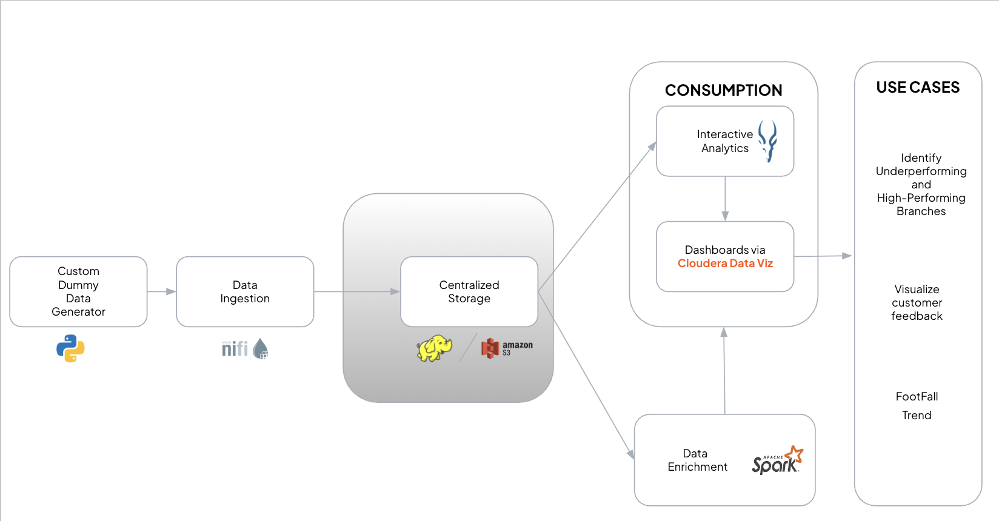

== Steps to Run

=== 1. Clone the Dummy Data Generator Repository

Clone the repository containing the dummy data generators and run the script to start all services:

[source,shell]
----
git clone https://github.com/cloudera/cloudera-partners.git
cd cloudera-partners
git checkout project-axon
cd Project-Axon/On-prem
----

=== 2. Set Up Python Virtual Environment and Install Dependencies

[source,shell]
----
sudo yum install -y python3 git
python3 -m ensurepip --upgrade
python3 -m venv venv
source venv/bin/activate
pip3 install -r ../assets/requirements.txt

# Verify Flask version
python3 -m flask --version
----

=== 3. Run the application

[source,shell]
----
bash ../assets/run_all.sh
----

- After running the script, verify that the dummy data endpoints are active using a `curl` command.
- Replace `<your-server-ip>` with the public IP of the node where you ran the script.

Example:
[source,shell]
----
curl http://<your-server-ip>:5400/footfall/summary
curl http://<your-server-ip>:8000/campaign-details
----

Sample JSON response from the campaign API:
[source,json]
----
{
  "Budget": 351527.55,
  "CampaignID": 17,
  "CampaignName": "Mclean-Tran Loan Offer",
  "Channel": "Bank Website",
  "EndDate": "2025-07-21",
  "SeasonID": 3,
  "StartDate": "2025-07-14",
  "Status": "Active"
}
----

You should see a JSON response similar to the above.

=== 4. Configuration on `NiFi Registry` UI

.. Login to the `NiFi Registry` UI.
.. Create a new bucket (for example, name it `Axon-Files`).
... Click on the wrench `🔧` icon on the top right corner to open settings.
+
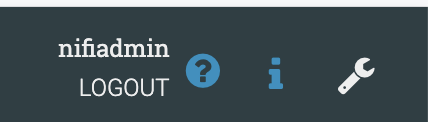
... Click on *New bucket* and name it `Axon-Flow`.
+
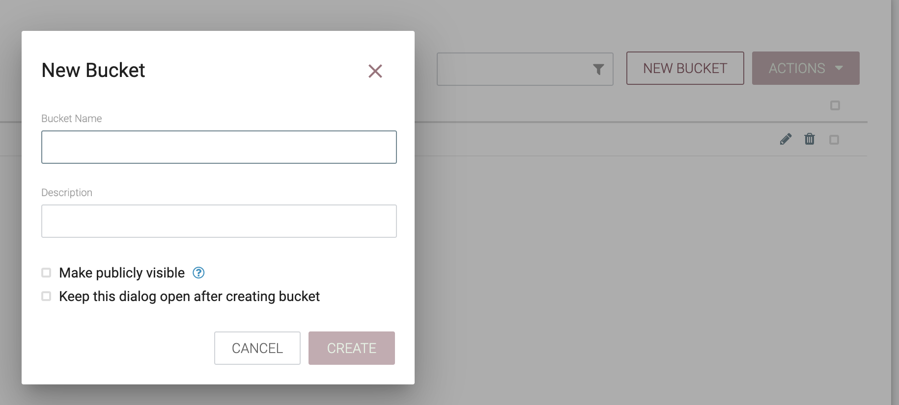

.. Upload the Project-Axon flow to the Registry:
... Click on the *Import New Flow* button at the top-right corner of the Registry UI.
+
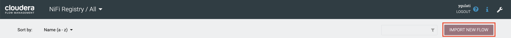
+
... Enter a name for the flow (e.g., `Project-Axon`).
... Select the `Axon-Flow` bucket.
... Upload the flow file https://github.com/cloudera/End2EndLabs/blob/main/Project-Axon/On-prem/Project-Axon.json[`Project-Axon.json`] and click **Import**.
+
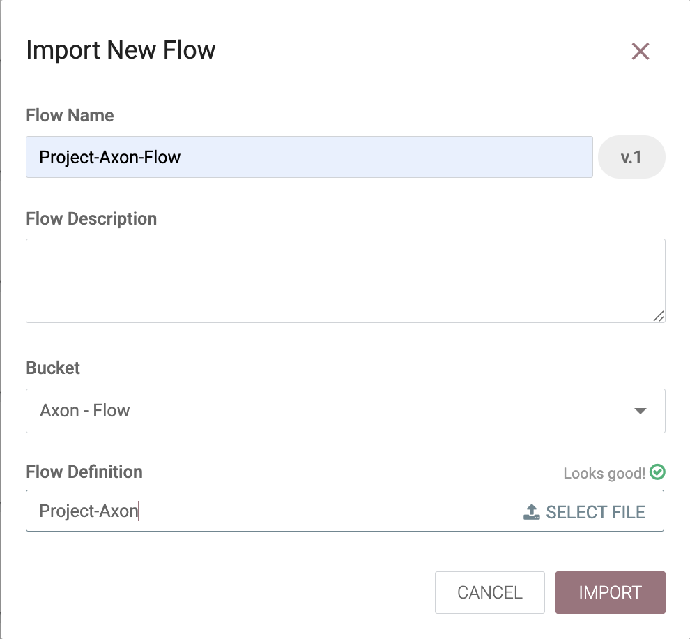

=== 5. Import the NiFi Flow into NiFi from Registry

- Go to NiFi UI.
- Drag a new **Process Group** onto the canvas.
- Give it any name (e.g., `Project-Axon`).
+
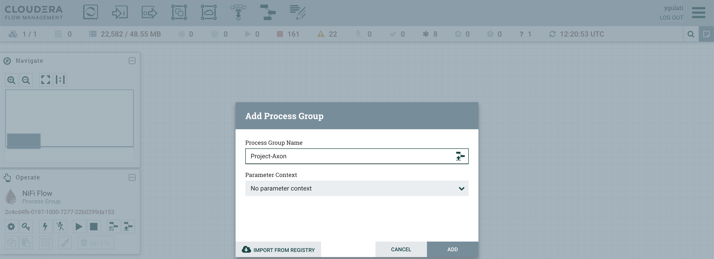
+
- After naming it, click **Import from Registry**.
- Select the `Axon-Flow` bucket, choose the `Project-Axon` flow and desired version, then click **Import**.
+
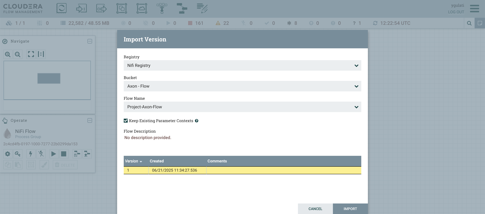

=== 6. Configure Apache NiFi (HDFS Access)

To enable Hue and Hive to read files from HDFS, ensure NiFi has authenticated HDFS access using Kerberos.

==== Step 1: Locate the HDFS keytab file
[source,shell]
----
find / -name hdfs.keytab
----

==== Step 2: Verify keytab contents (optional)
[source,shell]
----
klist -kt /run/cloudera-scm-agent/process/1546343796-hdfs-NAMENODE/hdfs.keytab
----

==== Step 3: Authenticate with Kerberos
[source,shell]
----
kinit -kt /run/cloudera-scm-agent/process/1546343796-hdfs-NAMENODE/hdfs.keytab hdfs/pvcbasemaster.cldrsetup.local@CLDRSETUP.LOCAL
----

==== Step 4: Assign appropriate permissions to the keytab
[source,shell]
----
chmod 644 /run/cloudera-scm-agent/process/1546343796-hdfs-NAMENODE/hdfs.keytab
----

==== Step 4: Create HDFS target directory

Create the /Axon-Files/ directory and set the permissions using the following commands.
[source,shell]
----
hdfs dfs -mkdir /Axon-Files
# Replace <username> with your user.
# For example: hdfs dfs -chown -R admin:hive /Axon-Files
hdfs dfs -chown -R <username>:hive /Axon-Files
hdfs dfs -chown -R <username>:hive /warehouse
hdfs dfs -chmod -R 775 /Axon-Files
hdfs dfs -ls /Axon-Files/   # You can use this command to verify the data when it comes to HDFS from NiFi
----

=== 7. Update the Parameter Contexts in NiFi Flow

After importing the `Project-Axon` flow into NiFi and *before starting it*, you must update the required parameters in the *Parameter Context* named `axon-param`. These parameters include:

- The HTTP URL used by `InvokeHTTP` processors.
- Kerberos credentials used by `PutHDFS` processors.

.Steps:
1. Go to the *NiFi UI* in your browser.

2. Double-click on the `Project-Axon` Process Group to open it.

3. In the top-right corner, click on the *three-line menu* (`≡`), and select *Parameter Contexts*.

4. Find the `axon-param` Parameter Context and click the *pencil icon* (✎) to edit it.

5. In the *Parameters* tab, locate the following parameters:
   - `http url`
   - `kerberos.principal`
   - `kerberos.keytab`

6. Update the values of each parameter:
   - For `http url`, update only the IP address part with the *Public IP address* of the server running your dummy data generator app.
   - For `kerberos.principal`, provide the valid Kerberos principal.
   - For `kerberos.keytab`, provide the full path to the keytab file.
+
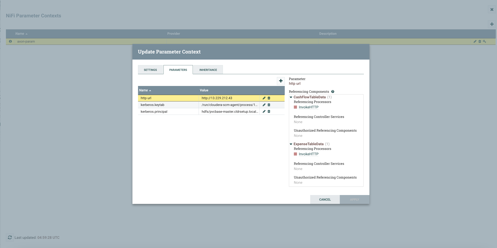
+
7. Click *Apply* to save the changes.

NOTE: These parameter values will be automatically picked up by the corresponding processors and controller services in the flow. No need to update them manually in each sub-flow.

=== 8. Start the `Project-Axon` NiFi Flow
- Inside the process group, right-click and select **Start**.
+
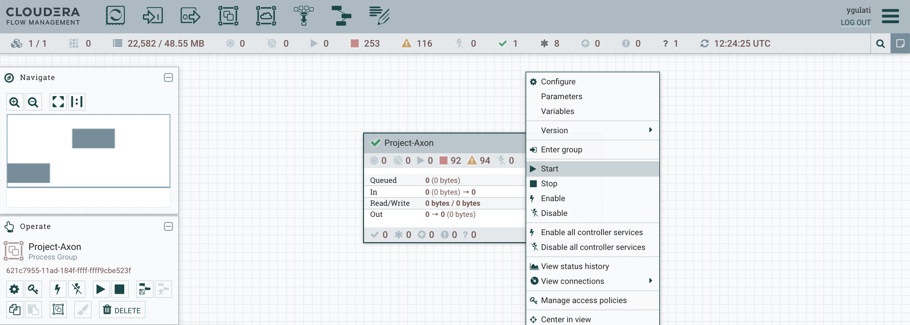

NOTE: After starting the flow, run it for a maximum of 5 minutes. It will generate approximately **50–80 flow files**.  
After that, right-click and click **Stop**, otherwise it will continue generating files indefinitely.

=== 9. Create Hive Tables via Hue

Go to **Hue → Query Editor → Hive**.

To create all the required databases and tables at once, simply:

- Open the 'create_queries.txt' file from the cloned folder.
- Copy the entire content.
- Paste it into the Hue Query Editor.
- Select all and click the **Run** button.
+
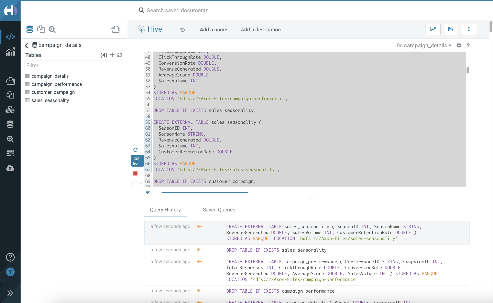

This will create all the necessary Hive tables and databases for the project in one go.

==== 9.1. Verify Table Creation & Data Load

To verify that all tables were successfully created and contain data:

- Copy the content of the file verify_tables.txt — this includes a Hive query to count rows across all expected tables.
- Paste it into the *Hue Query Editor*.
- Click *Run*.

You should see a list of table names with their row counts.

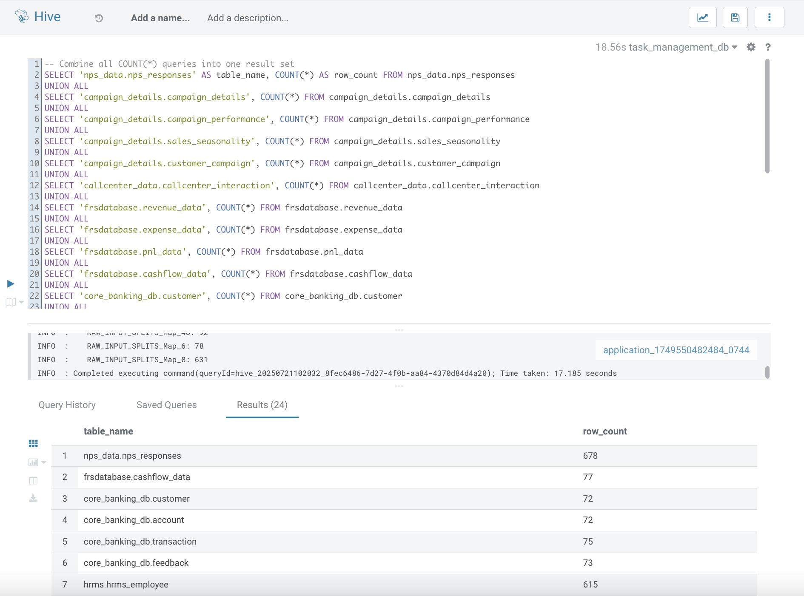

If any table shows a count of `0`, you may need to revisit the data ingestion step for that table.

=== 9.2. Integrate Hue SQL AI Assistant (Optional)

Follow the steps below to integrate the Hue SQL AI Assistant with Amazon Bedrock. While there are multiple ways to integrate the Hue SQL AI Assistant, this demo uses Amazon Bedrock.

==== Prerequisites
- Access to the AWS Management Console
- Permissions to use Amazon Bedrock and IAM
- Cloudera Data Warehouse with a running Hive Virtual Warehouse

==== Steps

. Log in to the AWS Management Console and navigate to the *Amazon Bedrock* service.

. In the left navigation pane, click *API keys*.
.. Under *Long-term API keys*, click *Generate long-term API key*.
+
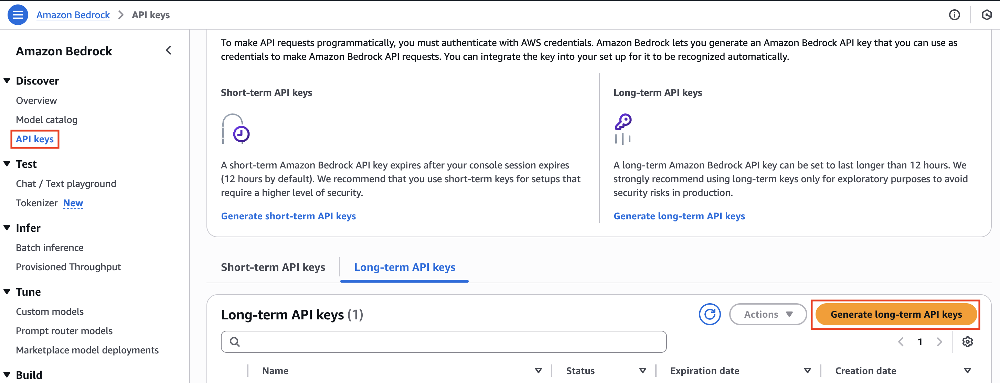
+
.. Set the expiration date and generate the key.
+
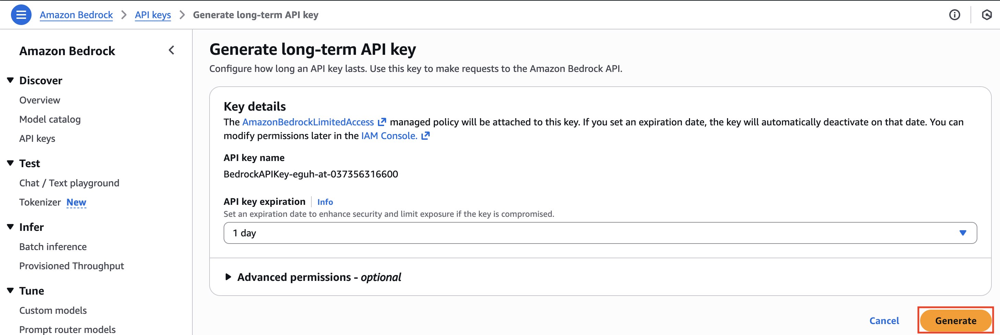
+
.. Make a note of the generated API key.

. Navigate to the *IAM* service.
.. Go to *Users* and search for the user named `BedrockAPIKey-xxxx`.
.. Select the user and click *Create access key*.
+
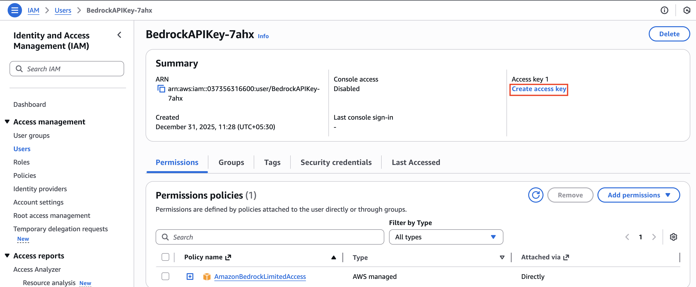
+
.. Copy the *Access Key ID* and *Secret Access Key*.
+
These credentials will be used by Hue to access Amazon Bedrock.

. Go to the *Cloudera Data Warehouse* service.
.. Click the three-dot menu next to the *Hive Virtual Warehouse* and select *Edit*.
+
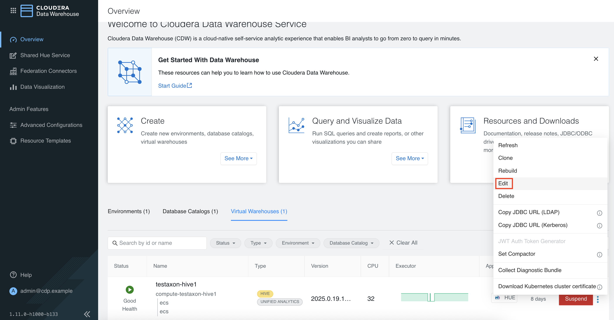
+
.. Navigate to the *Configurations* tab.
.. Select *Hue* from the left panel.

. From the *Configuration files* dropdown, select `hue-safety-valve`.

. Remove any existing content and paste the following configuration, replacing the placeholders with your values:
+
[source,ini]
----
[aws]
[[aws_accounts]]
[[[default]]]
access_key_id=<AWS_ACCOUNT_ACCESS_KEY_ID>
secret_access_key=<AWS_ACCOUNT_SECRET_ACCESS_KEY>
region=<AWS_REGION>

[[bedrock_account]]
access_key_id=<BEDROCK_USER_ACCESS_KEY_ID>
secret_access_key=<BEDROCK_USER_SECRET_ACCESS_KEY>
region=<AWS_REGION>

[desktop]
[[ai_interface]]
service='bedrock'
model='claude3'
----
+
. Click *Apply* and wait for the Virtual Warehouse to update.
+
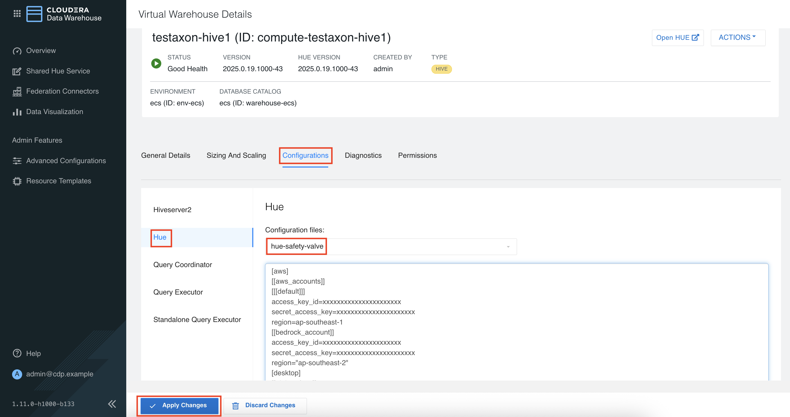
+
. When you open Hue, the AI Assistant bar is visible at the top, allowing you to generate, explain, and optimize queries.
+
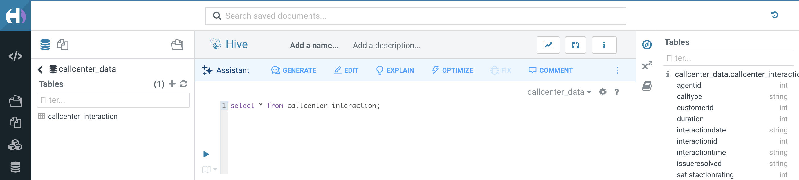

=== 10. Create a Spark Job using Cloudera Data Engineering (CDE)

In this section, you will create and schedule a Spark job that summarizes call center interactions for each day.

This Spark job:

* Reads data from the `callcenter_interaction` table.
* Aggregates metrics such as resolved calls, unresolved calls, average duration, and average satisfaction rating.
* Appends the summary into the `callcenter_interaction_summary` table for the given date.
* Runs daily on a schedule via CDE.

==== 10.1. Create Spark Job

. Click on *Data Services* from Cloudera Manager UI and click on *Open CDP Private Cloud Data Services* to access the Data Services Homepage .
+
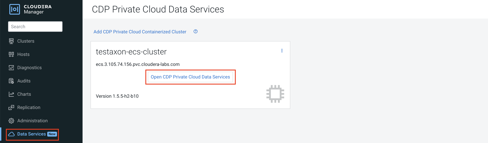
+
. Navigate to *Cloudera Data Engineering* and click on *Jobs* from the side panel.
+
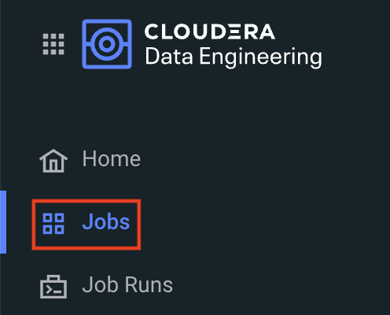
+
. Before creating the job, make sure you open the file in an editor and replace the placeholder `<username>` with the user you are planning to run the script.
+
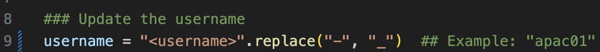
+
. Click on *Create Job* and enter the following values:
+
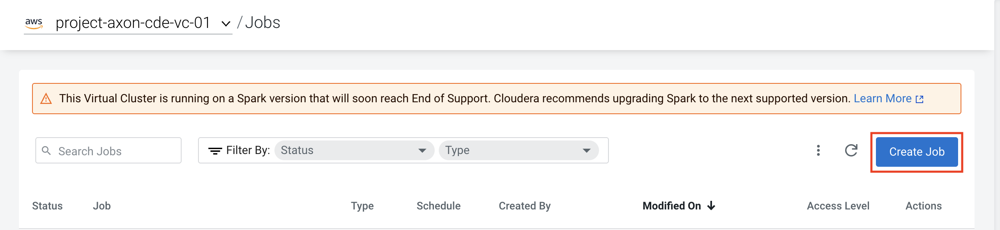
+
.. Select the job type as *Spark*.
.. Give a name to your Spark job (e.g. `CallCenterSummary`).
.. Under *Select Application Files*, upload the `CallCenterSummary.py` file  
   (available in the assets folder on GitHub).
+
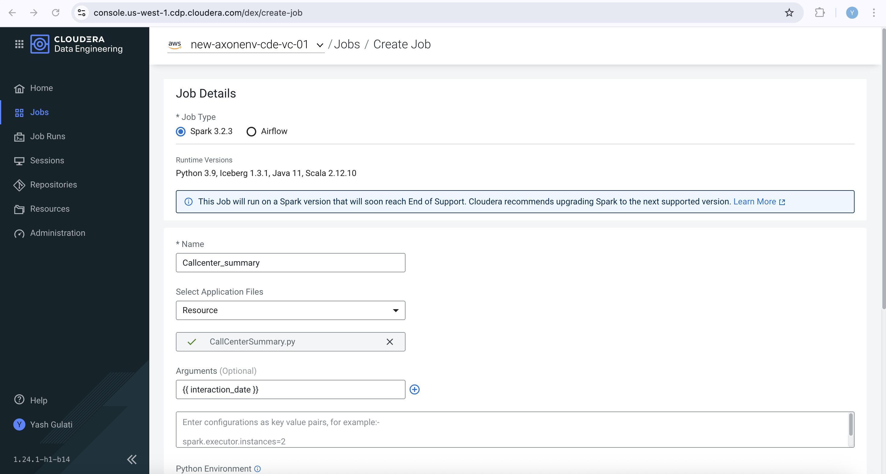
+
. From the *Create and Run* dropdown, click *Create* (do not run it yet).
. The script will automatically create the summary table `callcenter_interaction_summary` if it does not exist.

==== 10.2. Run the Job

. Trigger the Spark job once by passing a date argument, for example:
+
----
2025-08-12
----
. Verify that the output is appended to the summary table by running:

[source,sql]
----
SELECT * 
FROM callcenter_data.callcenter_interaction_summary
ORDER BY interactiondate DESC;
----

==== 10.3. Create an Airflow Connection

. Navigate to the *Virtual Cluster Details* page and click on *Airflow UI*.
+
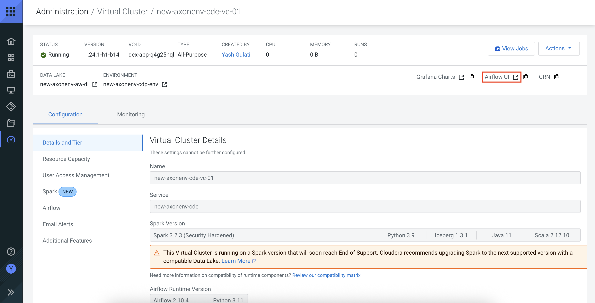
+
. In the top navigation bar, go to *Admin* → *Connections* to create a new connection.
+
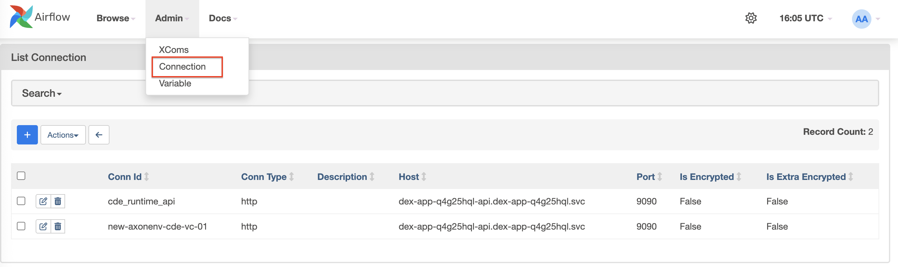
+
. On the Connections page, click on the *+* icon to create a new connection.
+
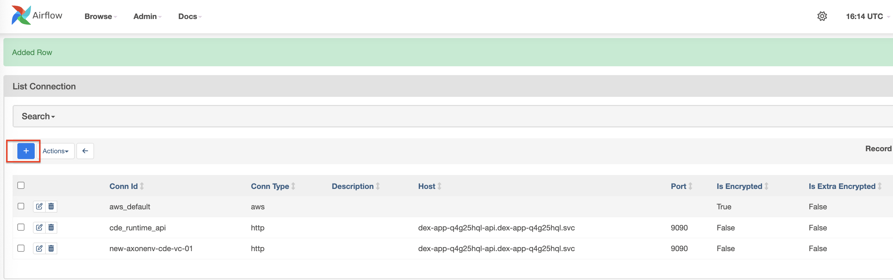
+
. Fill in the following details:
+
* *Connection ID*: `impala_default`
* *Connection Type*: `Impala`
* *Host*: Enter the `hostname` copied from the JDBC connection URL. Do not enter the full JDBC URL.
* *Schema*: `callcenter_data`
* *Login*: `admin`
* *Password*: Enter your Kerberos password
* *Port*: `443`
* *Extra*:
+
[source,json]
----
{
  "auth_mechanism": "LDAP",
  "use_ssl": "True",
  "use_http_transport": "True",
  "http_path": "cliservice"
}
----

. Click *Test* to validate the connection.
. Once the test is successful, click *Save*.
+
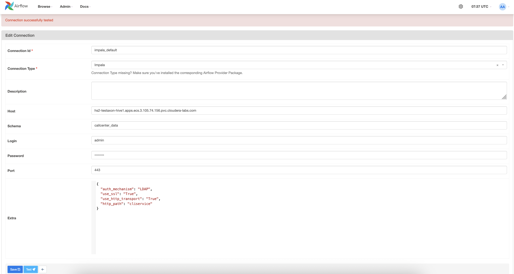

==== 10.4. Create a CDE Airflow DAG

Create an Airflow DAG to orchestrate the daily execution of the `CallCenterSummary.py` Spark job.  
This ensures that the job runs only for unprocessed dates and maintains a record of what has already been processed. 

The DAG logic:

* Bootstrap Check: It runs SHOW TABLES to see if the summary table exists. A Branching Operator then directs the DAG to either a "First Run" or "Incremental" path.

* Targeted Date Fetch: On the first run, it fetches the absolute earliest date available; on subsequent runs, it identifies the oldest date currently missing from the summary table.

* Short-Circuit Guard: If no new dates are found, the ShortCircuitOperator stops the DAG immediately to prevent the Spark job from running unnecessarily.

* Parameterized Trigger: Once a date is confirmed, it passes that specific value to the CDE Spark job, ensuring only one day’s data is processed at a time.

Steps:

. Go back to the *Jobs* section from the left pane.
. Click on *Create Job* and enter the following parameters:
+

+
.. Select the job type as *Airflow*.
.. Give a name to your job (e.g. `CallCenterSummaryDag`).
+
.. Upload the DAG file `Dag_job_on-prem.py`  
   (available in the assets folder).

. From the *Create and Run* dropdown, click *Create* (do not run it yet).
+
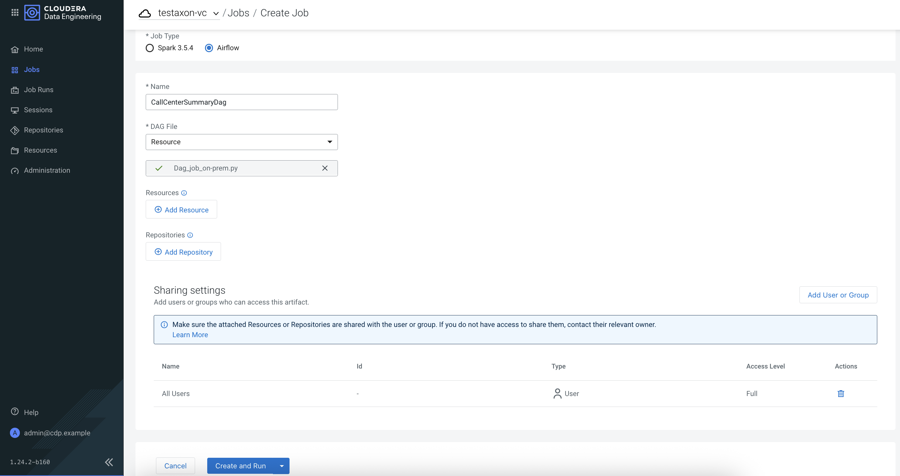
+
. The DAG is scheduled to run daily at `16:30 UTC`.
. Once triggered, the DAG will:
* Identify the next unprocessed interaction date.
* Run the Spark job for that date.

You can view DAG run history and logs in the CDE Airflow UI.

==== 11. Connect DataViz to Impala

To enable DataViz to read data from Hive, you need to create a connection in the DataViz UI. 

While Hive is supported, it is *recommended to use Impala* for creating the connection, as Impala is a high-performance, distributed SQL engine optimized for fast, interactive analytics on large-scale datasets.

- Go to *Cloudera DataViz* and navigate to the *Data* tab.
- Click *+ New Connection* → *Impala*.
+
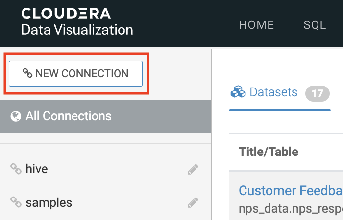
+
[width="90%",cols="40%,50%",options="header"]
|===
|**Parameter** |**Value**
|*Connection Name* |Impala-Axon (or any name you prefer)
|*Connection type* |Impala
|*Hostname* |pvcbase-worker1.cldrsetup.local (or your any Impala Daemon host)
|*Port* |21050 (for Impala)
|*Kerberos Credentials* |Use your admin username and password

2+|*Advanced Tab Settings*

|*Connection Mode* |Binary
|*Authentication Mode* |Kerberos
|*Kerberos Service Name* |Enter any name (e.g., `impala`)
|===
+
- Click *Test Connection* to verify.
+
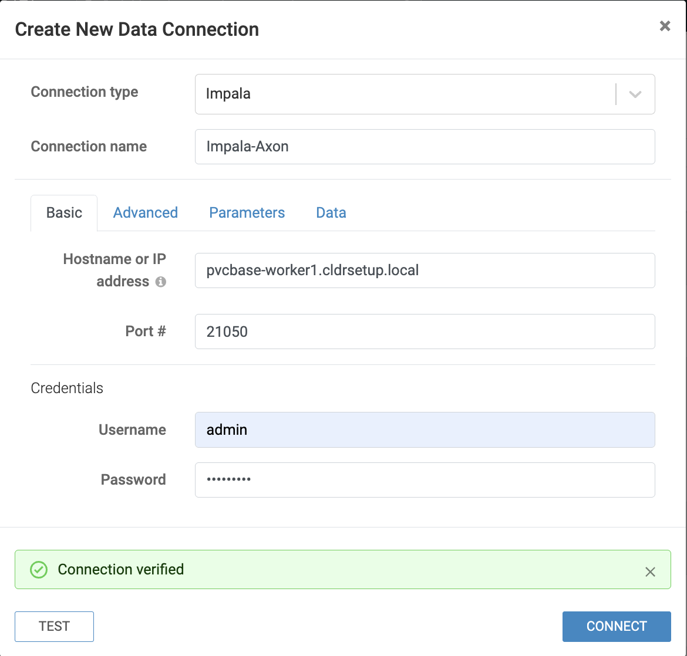
+
- Once successful, click *Save*.
- You can now use this connection to create/import datasets and build/import dashboards from Impala tables.

=== 12. Add Ranger Policy for DataViz Access

Before importing the dashboard into Cloudera DataViz, you must ensure the `dataviz` user has access to the Impala databases and tables. This is done by updating an existing policy in Apache Ranger.

- Log in to the *Ranger Admin UI* using admin credentials.
- Select the service named *Hadoop SQL*.
- Locate the policy named `9 all - database, table, column`.
- Click on the *Edit* icon to open it.
+
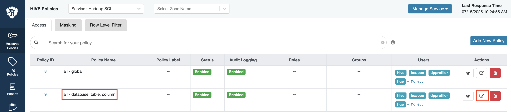
+
- In the *Users* section, add `dataviz` to the list.
- Scroll down and click *Save*.

=== 13. Import Dashboard into DataViz

- Go to *Cloudera DataViz*.  
  You can access the DataViz UI using the default admin credentials:  
  `vizapps_admin / vizapps_admin`.

- Navigate to the *Data* tab, then click on *Import visual artifacts*.
+
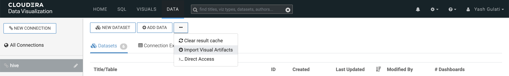
+
- Upload the dashboard JSON file: https://github.com/cloudera/End2EndLabs/blob/main/Project-Axon/assets/project_axon_dashboard.json[project_axon_dashboard.json].
- After uploading, click on *Accept and Import*, you will see an *Import Successful* message along with the list of datasets that were imported as part of the dashboard.
+
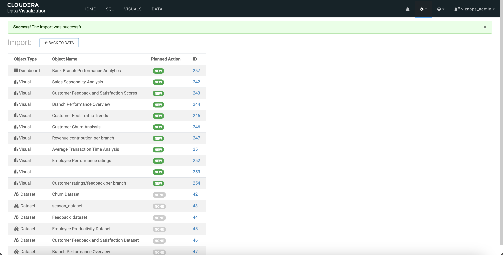
+
- Once imported, navigate to the *Visuals* tab and click on the dashboard to open and view it.
+
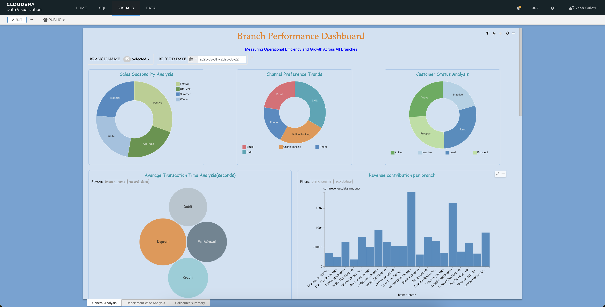

==== 13.1 Explore the *Callcenter-Summary* Dashboard

- As part of the Spark job we ran earlier, records are written into the `callcenter_interaction_summary` table.  
- In the same dashboard, click on the **Callcenter-Summary** tab.  
- This dashboard is directly connected to the `callcenter_interaction_summary` table and provides insights into daily call center interactions.  
- Whenever the Spark job appends new records to the table, you can refresh the dashboard and use the **Date filter** to view visuals for that day.  
+
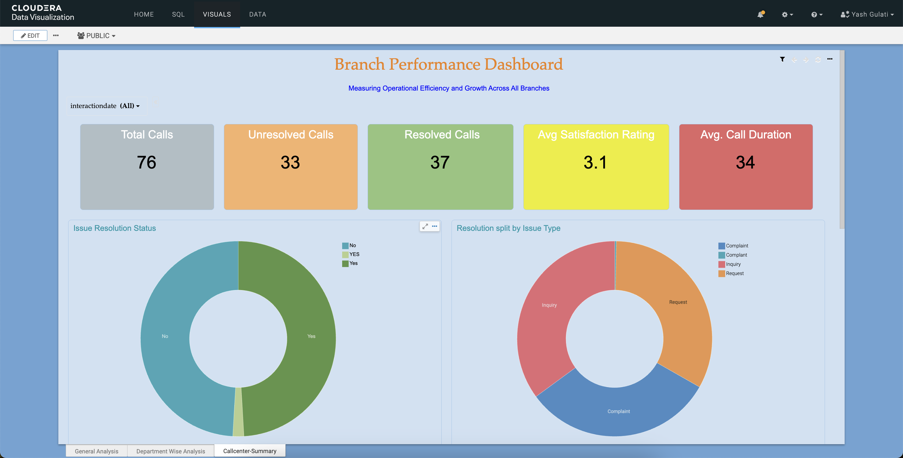

=== 14. Integrate AI Assistant in Cloudera Data Visualization (Optional)

This section describes how to integrate the AI Assistant in Cloudera Data Visualization using a model hosted on Cloudera AI Inference.

Alternatively, the AI Assistant can also be integrated using external model providers such as OpenAI or Amazon Bedrock. For more details on configuring external model providers, click https://docs.cloudera.com/data-visualization/8/howto-manage-site-settings/topics/viz-site-settings-ai-config.html[here].

==== Prerequisites

Before proceeding, ensure the following prerequisites are met:

* You have administrator access to the Cloudera Data Visualization service.
* A model is deployed using Cloudera AI Inference, and a model endpoint has been created.
** Example model: Qwen/Qwen2.5-7B-Instruct

==== Configuration Steps

. Navigate to the Cloudera Data Visualization service from either:
* The Base Cluster, or
* The Cloudera Data Warehouse service

. Click the *Settings* (gear) icon and select *Site Settings*.
+
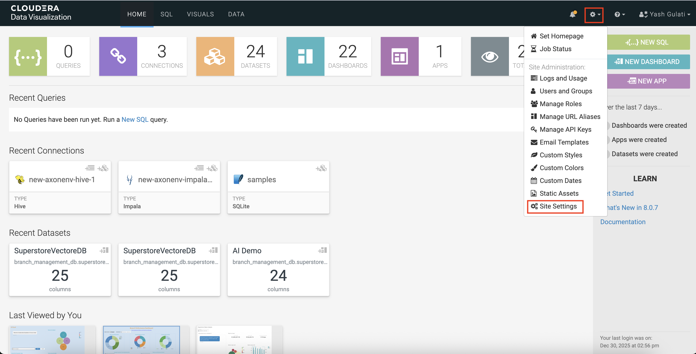
+
. Under *AI Settings*, select *Completion*, then click *Create Profile*.
+
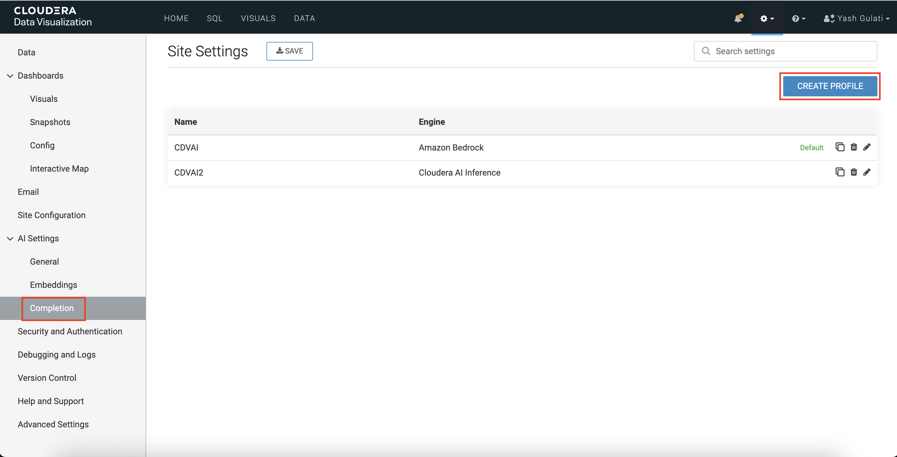
+
. Enter the following details to create a completion profile:
+
* *Name*: Enter a name for the AI model profile.
* *Engine*: Select *Cloudera AI Inference* from the drop-down list.
* *API Key*: Enter the CDP Token associated with the deployed model endpoint.
* *Service URL*: Enter the base URL of the model endpoint from the Cloudera AI Registry.
* *Model*: Enter the name of the deployed model.

. Click *Test* to validate the configuration.
+
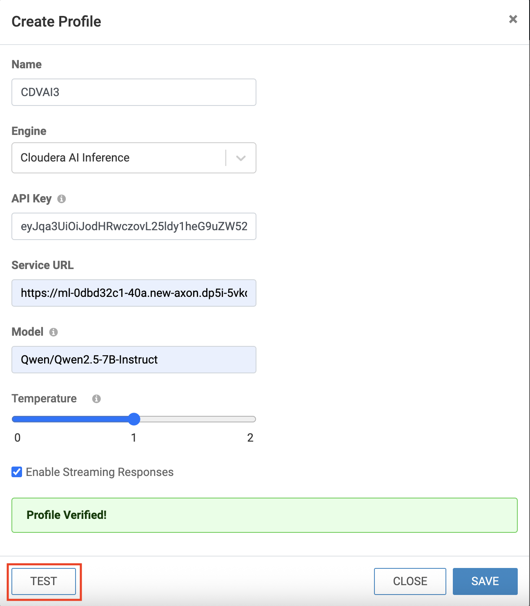
+
. Once the profile status shows *Profile Verified*, click *Save* to complete the setup.

==== Creating an AI Visual

This section describes how to create and use an AI Visual in Cloudera Data Visualization.

. Import the https://github.com/cloudera/End2EndLabs/blob/main/Project-Axon/assets/AI_Visual.json[`AI_Visual.json`] to add the AI Visual dashboard to Cloudera Data Visualization, following the same process used in the earlier steps.
+
. In the AI Visual input box, enter prompts to interact with your dataset.  
  The AI Visual enables conversational querying over the selected dataset.
+
.Example AI Visual Prompts
[cols="2,3", options="header"]
|===
| Example Prompt | Visual Updated

| What is the count of the transactions and total revenue in the East and West regions?
| Revenue by Region

| Show the sum of transaction amounts by transaction type for Credit and Withdrawal
| Amount by Transaction Type

| Show the total revenue for records dated in 2023 and 2024
| Total Revenue by Date
|===
+
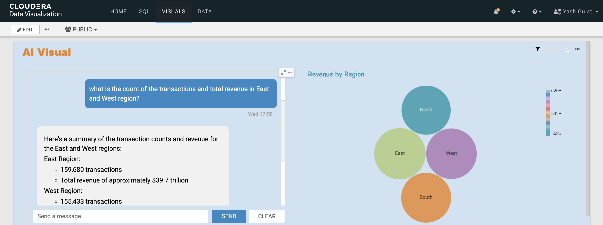
+
. Once the AI Visual generates a response, click the *Share* icon and select *Share Parameters*.
  This allows the generated parameters to update other visuals in the dashboard, if applicable.
+
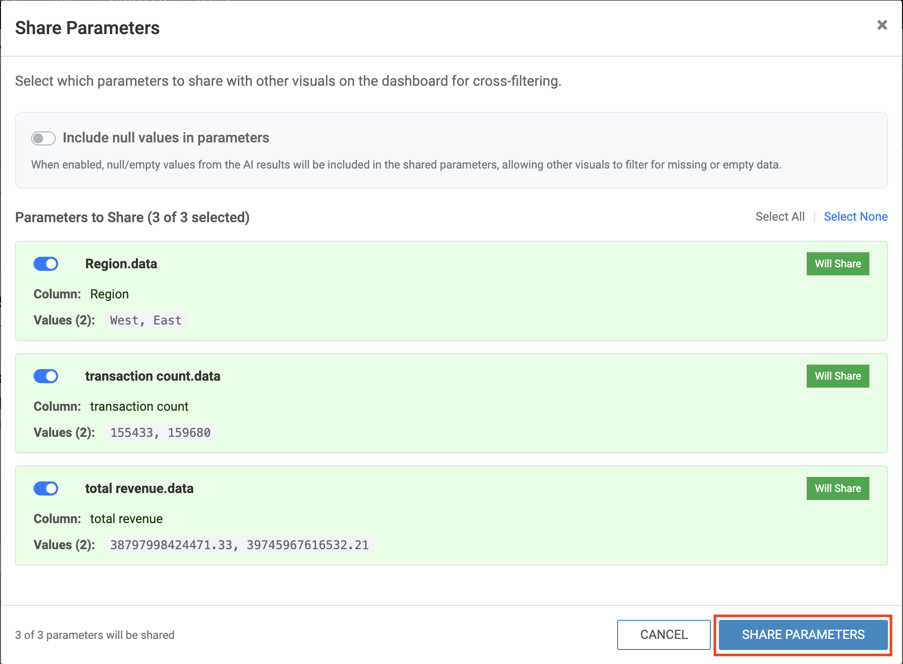
+
NOTE: The parameters referenced by the AI Visual must match the parameters used in the corresponding visuals for them to update correctly.
+
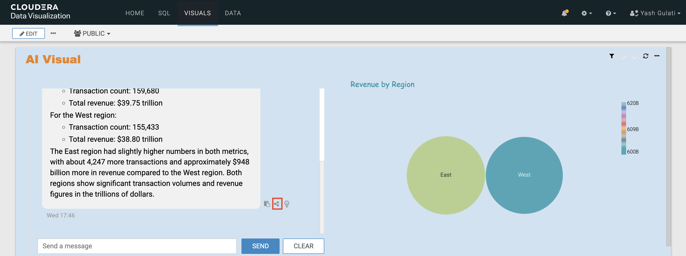
+
. You can create multiple AI model profiles, as described in the previous section, and dynamically switch between them using the AI Visual settings.
+
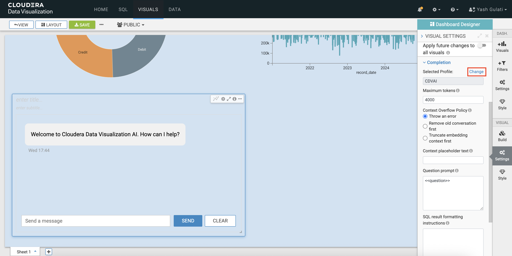
+
. You can also provide custom SQL generation instructions within the AI Visual settings to control how queries are generated.

==== Result

The AI Visual allows users to explore data conversationally and dynamically drive other dashboard visuals using shared parameters.

=== 15. Accessing DataViz as Individual Users

To allow multiple users to view or interact with dashboards, follow the steps below to create individual user accounts in Cloudera DataViz:

==== Step 1: Log in as Admin

- Open the DataViz from the base cluster.
- Log in using the default admin credentials:
+
[source,text]
----
Username: vizapps_admin
Password: vizapps_admin
----

==== Step 2: Create a New User

- Once logged in, navigate to the settings icon and click on **Users and Groups**.
- Click on the **New User** button.
+
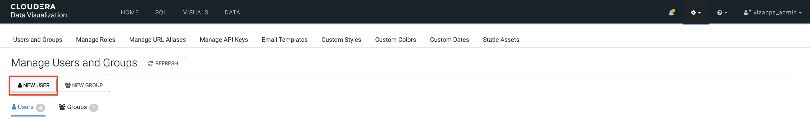

==== Step 3: Fill in User Details

- Enter the required details:
  * `Username`: (e.g., `jdoe`)
  * `Full Name`: (e.g., `John Doe`)
  * `Password`: Set a secure password for the user
- Assign appropriate permissions:
  * For **read-only access**, select the **Visual Consumer** role.
  * Other roles include **System Admin**, **Database Admin**, and **Analyst**, depending on the level of access needed.
+
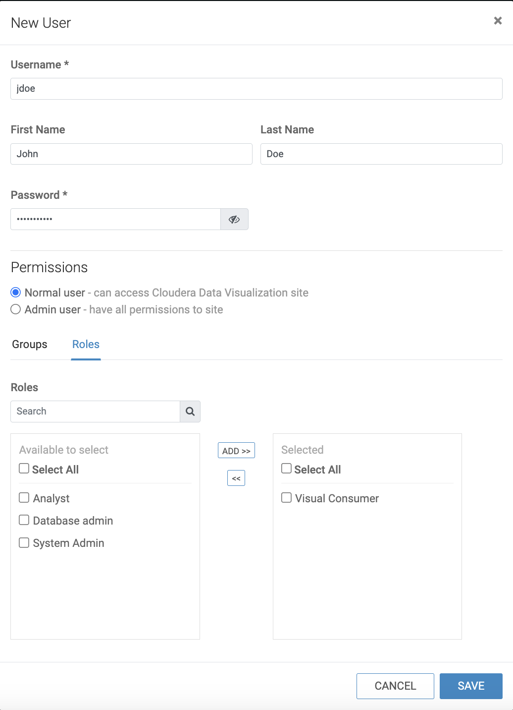

==== Step 4: User Logs In

- The newly created user can now log in to DataViz using the credentials provided.
- Depending on their role, they will have access to view, edit, or manage dashboards and datasets.

== Contact

For questions, feedback, or demo support, please reach out to the **Partner Solutions Engineering** team at Cloudera.
