= Project Axon: Bank Branch Performance Analytics
:author: Yash Gulati
:revdate: 2025-06-20
:toc:
:toclevels: 2

== Introduction

*Project Axon* is a comprehensive end-to-end demonstration of Cloudera’s capabilities across the full data lifecycle — from data ingestion to dashboarding. 

The goal of this project is to help partners:
- Understand how to practically use Cloudera Private Cloud for real-time and batch analytics.
- Identify a relevant and easy-to-explain use case.
- Showcase a ready-to-deploy demo to customers after initial discovery conversations.

**Use Case Chosen:** *Bank Branch Performance Analytics*

This use case helps simulate and analyze the operational performance of various bank branches using dummy data, allowing visual insights via dashboards.

== Prerequisites

=== 1. Linux Server for running Dummy Data Generator App

Ensure you have access to any running **Linux server** for hosting the dummy data generator application. 
A minimal cloud instance like **t3.small** (2 vCPUs, 2 GB RAM) is sufficient for running the application.

==== Required Open Ports
Make sure the following ports are open on the server's firewall or cloud security group:

- 8000
- 8085
- 5001
- 5003
- 5400
- 5500

=== 2. Cloudera Platform Requirements

Ensure you have a running **Cloudera Private Cloud Base Cluster** with the following components installed:

- Apache NiFi
- NiFi Registry
- HDFS
- Hive
- Impala
- Knox
- Hue
- Cloudera DataViz

=== 3. Host File Configuration

Update the `/etc/hosts` file to resolve Cloudera node hostnames. This is required to access the Knox gateway and other web UIs from your browser.

Below is a **sample** configuration. 
[source,txt]
----
::1             localhost

# Public Host Entries
3.0.146.46        ipaserver.cldrsetup.local        ipaserver
18.139.21.49      cldr-mngr.cldrsetup.local        cldr-mngr

# PvC Base Cluster Nodes (Replace these IPs with your actual node IPs)
54.169.43.150     pvcbase-master.cldrsetup.local   pvcbase-master
3.1.81.131        pvcbase-worker1.cldrsetup.local  pvcbase-worker1
18.143.63.177     pvcbase-worker2.cldrsetup.local  pvcbase-worker2

# PvC Data Services ECS Cluster Nodes (Replace these IPs with your actual ECS node IPs)
54.151.164.174    pvcecs-master.cldrsetup.local    pvcecs-master 
52.74.176.235     pvcecs-worker1.cldrsetup.local   pvcecs-worker1
47.129.34.14      pvcecs-worker2.cldrsetup.local   pvcecs-worker2
----

This project was developed and tested on the following component versions:

- **Cloudera Manager**: 7.11.3-CHF11  
- **CDP Base Runtime (CDH parcel)**: 7.1.9 SP1 CHF4  
- **Java**: 17.0.15  
- **Cloudera Flow Management (CFM)**: 2.1.7.2002-3  
- **Apache NiFi**: 1.28.1  
- **Cloudera DataViz**: 8.0.4-b47.p1.67141340

== Technology Stack

- **Data Generator**: Python (Flask + Faker)
- **Data Ingestion**: Apache NiFi
- **Storage**: HDFS (Parquet format)
- **Data Query Layer**: Hive tables created via Hue
- **Visualization**: Cloudera DataViz

== Project Workflow

image::../images/project_flow.png[project_flow]

== Steps to Run

=== 1. Clone the Dummy Data Generator Repository

Clone the repository containing the dummy data generators and run the script to start all services:

[source,shell]
----
git clone https://github.com/cloudera/cloudera-partners.git
cd cloudera-partners
git checkout project-axon
cd Project-Axon/On-prem
----

=== 2. Set Up Python Virtual Environment and Install Dependencies

[source,shell]
----
sudo yum install -y python3 git
python3 -m ensurepip --upgrade
python3 -m venv venv
source venv/bin/activate
pip3 install -r ../assets/requirements.txt

# Verify Flask version
python3 -m flask --version
----

=== 3. Run the application

[source,shell]
----
bash ../assets/run_all.sh
----

- After running the script, verify that the dummy data endpoints are active using a `curl` command.
- Replace `<your-server-ip>` with the public IP of the node where you ran the script.

Example:
[source,shell]
----
curl http://<your-server-ip>:5400/footfall/summary
curl http://<your-server-ip>:8000/campaign-details
----

Sample JSON response from the campaign API:
[source,json]
----
{
  "Budget": 351527.55,
  "CampaignID": 17,
  "CampaignName": "Mclean-Tran Loan Offer",
  "Channel": "Bank Website",
  "EndDate": "2025-07-21",
  "SeasonID": 3,
  "StartDate": "2025-07-14",
  "Status": "Active"
}
----

You should see a JSON response similar to the above.

=== 4. Configuration on `NiFi Registry` UI

.. Login to the `NiFi Registry` UI.
.. Create a new bucket (for example, name it `Axon-Files`).
... Click on the wrench `🔧` icon on the top right corner to open settings.
+
image::../images/settings.png[settings]
... Click on *New bucket* and name it `Axon-Flow`.
+
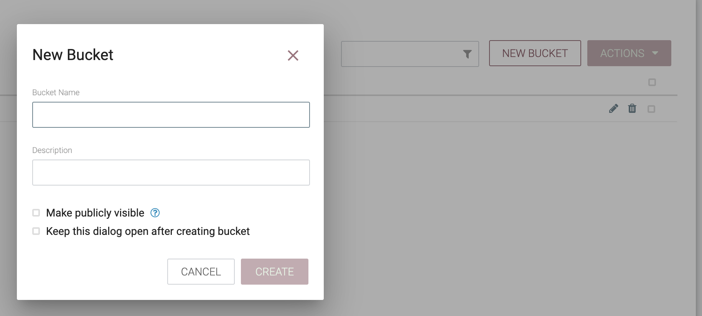

.. Upload the Project-Axon flow to the Registry:
... Click on the *Import New Flow* button at the top-right corner of the Registry UI.
+
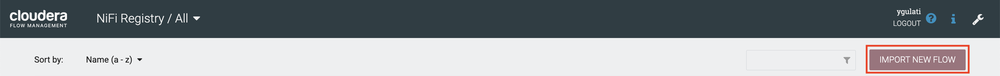
+
... Enter a name for the flow (e.g., `Project-Axon`).
... Select the `Axon-Flow` bucket.
... Upload the flow file https://github.com/cloudera/cloudera-partners/blob/project-axon/Project-Axon/Project-Axon.json[`Project-Axon.json`] and click **Import**.
+
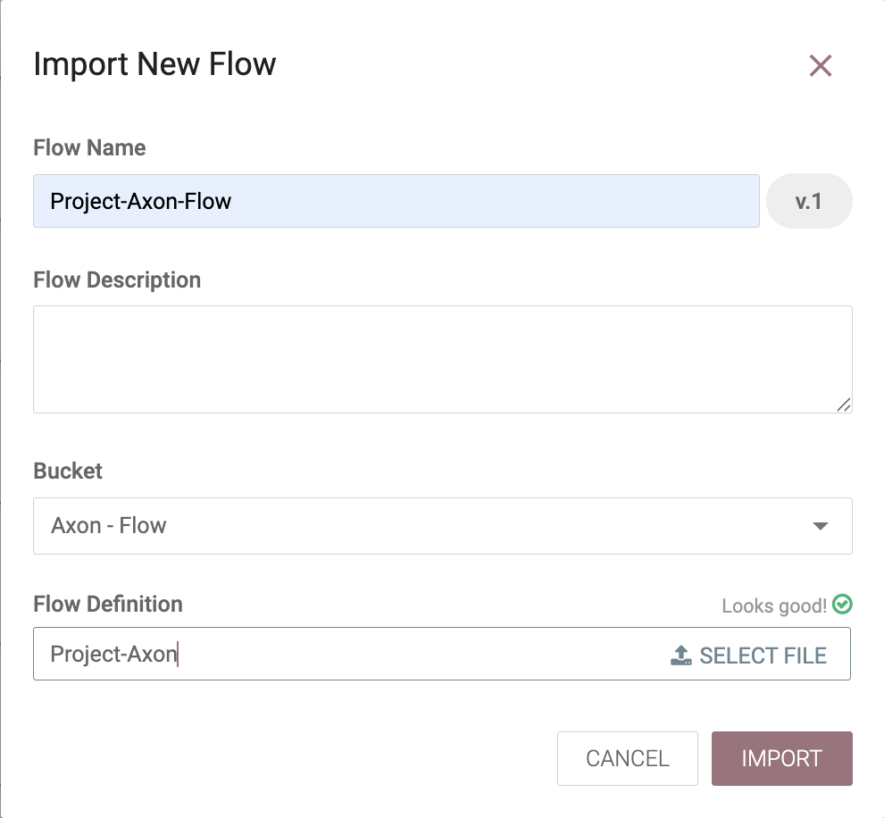

=== 5. Import the NiFi Flow into NiFi from Registry

- Go to NiFi UI.
- Drag a new **Process Group** onto the canvas.
- Give it any name (e.g., `Project-Axon`).
+
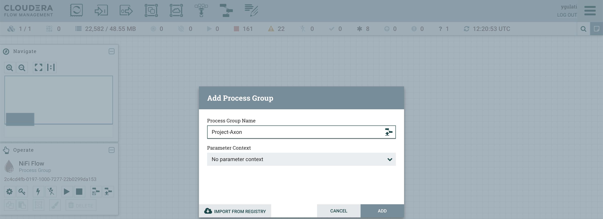
+
- After naming it, click **Import from Registry**.
- Select the `Axon-Flow` bucket, choose the `Project-Axon` flow and desired version, then click **Import**.
+
image::../images/import_version.png[import version]

=== 6. Configure Apache NiFi (HDFS Access)

To enable Hue and Hive to read files from HDFS, ensure NiFi has authenticated HDFS access using Kerberos.

==== Step 1: Locate the HDFS keytab file
[source,shell]
----
find / -name hdfs.keytab
----

==== Step 2: Verify keytab contents (optional)
[source,shell]
----
klist -kt /run/cloudera-scm-agent/process/1546343796-hdfs-NAMENODE/hdfs.keytab
----

==== Step 3: Authenticate with Kerberos
[source,shell]
----
kinit -kt /run/cloudera-scm-agent/process/1546343796-hdfs-NAMENODE/hdfs.keytab hdfs/pvcbasemaster.cldrsetup.local@CLDRSETUP.LOCAL
----

==== Step 4: Create HDFS target directory
[source,shell]
----
hdfs dfs -mkdir /Axon-Files
----

=== 7. Update the Parameter Contexts in NiFi Flow

After importing the `Project-Axon` flow into NiFi and *before starting it*, you must update the required parameters in the *Parameter Context* named `axon-param`. These parameters include:

- The HTTP URL used by `InvokeHTTP` processors.
- Kerberos credentials used by `PutHDFS` processors.

.Steps:
1. Go to the *NiFi UI* in your browser.

2. Double-click on the `Project-Axon` Process Group to open it.

3. In the top-right corner, click on the *three-line menu* (`≡`), and select *Parameter Contexts*.

4. Find the `axon-param` Parameter Context and click the *pencil icon* (✎) to edit it.

5. In the *Parameters* tab, locate the following parameters:
   - `http url`
   - `kerberos.principal`
   - `kerberos.keytab`

6. Update the values of each parameter:
   - For `http url`, update only the IP address part with the *Public IP address* of the server running your dummy data generator app.
   - For `kerberos.principal`, provide the valid Kerberos principal.
   - For `kerberos.keytab`, provide the full path to the keytab file.
+
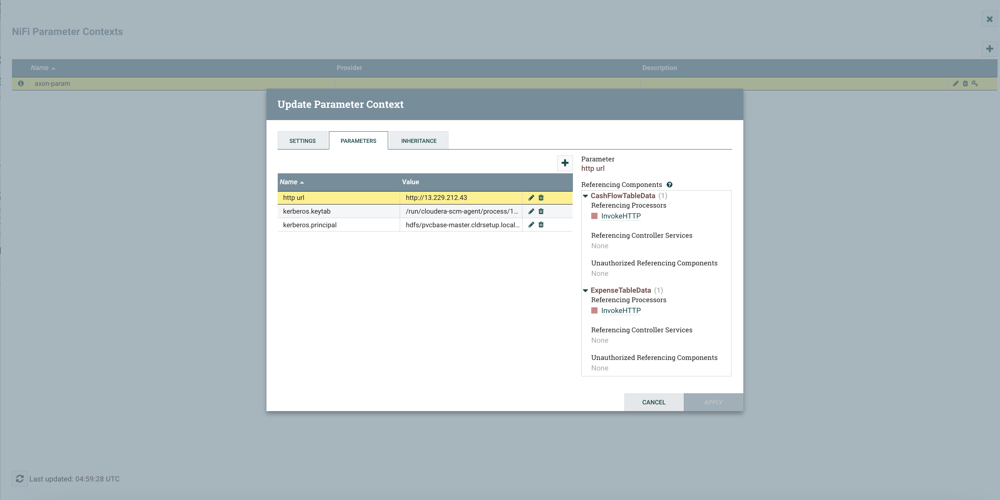
+
7. Click *Apply* to save the changes.

NOTE: These parameter values will be automatically picked up by the corresponding processors and controller services in the flow. No need to update them manually in each sub-flow.

=== 8. Start the `Project-Axon` NiFi Flow
- Inside the process group, right-click and select **Start**.
+
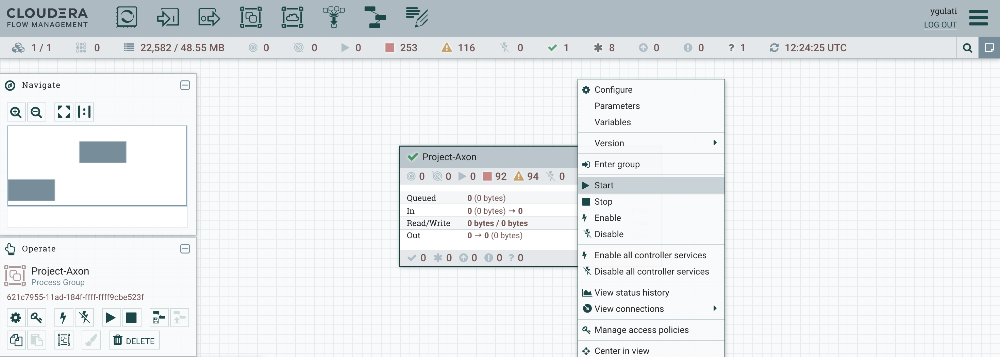

NOTE: After starting the flow, run it for a maximum of 5 minutes. It will generate approximately **50–80 flow files**.  
After that, right-click and click **Stop**, otherwise it will continue generating files indefinitely.

=== 9. Create Hive Tables via Hue

Go to **Hue → Query Editor → Hive**.

To create all the required databases and tables at once, simply:

- Open the https://github.com/cloudera/cloudera-partners/blob/project-axon/Project-Axon/create_queries.txt[create_queries.txt] file from the cloned folder.
- Copy the entire content.
- Paste it into the Hue Query Editor.
- Select all and click the **Run** button.
+
image::../images/hive_queries.png[hive_queries, width=800, height=500]

This will create all the necessary Hive tables and databases for the project in one go.

==== 9.1. Verify Table Creation & Data Load

To verify that all tables were successfully created and contain data:

- Copy the content of the file verify_tables.txt — this includes a Hive query to count rows across all expected tables.
- Paste it into the *Hue Query Editor*.
- Click *Run*.

You should see a list of table names with their row counts.

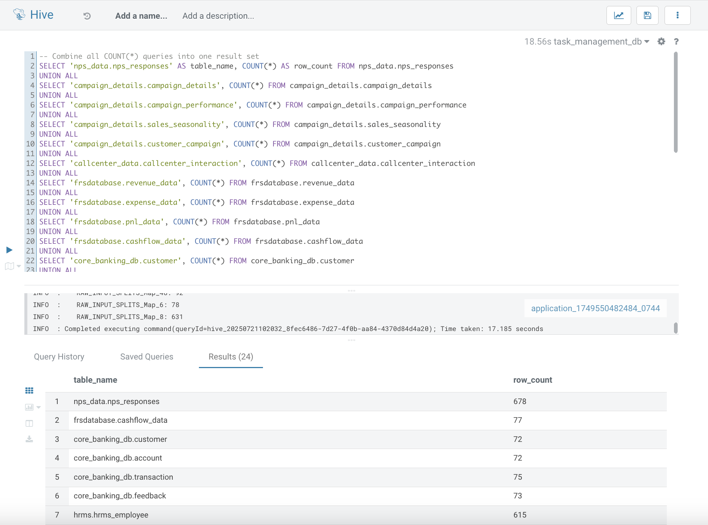

If any table shows a count of `0`, you may need to revisit the data ingestion step for that table.

=== 10. Connect DataViz to Impala

To enable DataViz to read data from Hive, you need to create a connection in the DataViz UI. 

While Hive is supported, it is *recommended to use Impala* for creating the connection, as Impala is a high-performance, distributed SQL engine optimized for fast, interactive analytics on large-scale datasets.

- Go to *Cloudera DataViz* and navigate to the *Data* tab.
- Click *+ New Connection* → *Impala*.
+
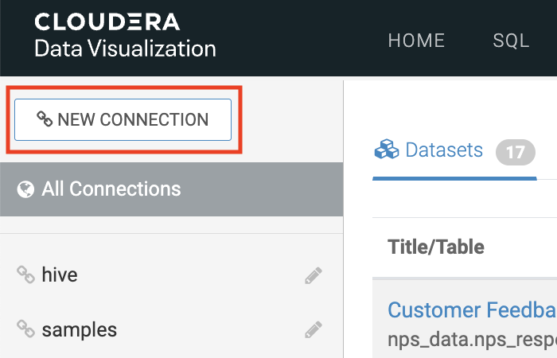
+
[width="90%",cols="40%,50%",options="header"]
|===
|**Parameter** |**Value**
|*Connection Name* |Impala-Axon (or any name you prefer)
|*Connection type* |Impala
|*Hostname* |pvcbase-worker1.cldrsetup.local (or your any Impala Daemon host)
|*Port* |21050 (for Impala)
|*Kerberos Credentials* |Use your admin username and password

2+|*Advanced Tab Settings*

|*Connection Mode* |Binary
|*Authentication Mode* |Kerberos
|*Kerberos Service Name* |Enter any name (e.g., `impala`)
|===
+
- Click *Test Connection* to verify.
+
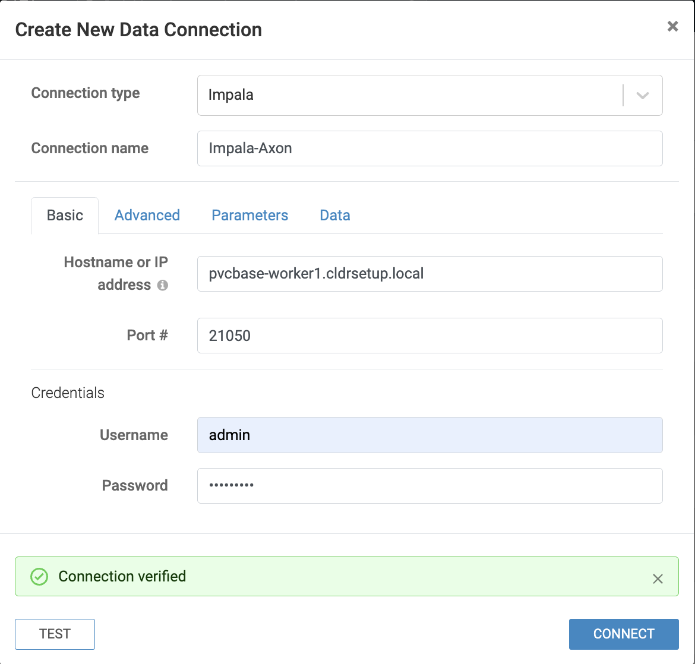
+
- Once successful, click *Save*.
- You can now use this connection to create/import datasets and build/import dashboards from Impala tables.

=== 11. Add Ranger Policy for DataViz Access

Before importing the dashboard into Cloudera DataViz, you must ensure the `dataviz` user has access to the Impala databases and tables. This is done by updating an existing policy in Apache Ranger.

- Log in to the *Ranger Admin UI* using admin credentials.
- Select the service named *Hadoop SQL*.
- Locate the policy named `9 all - database, table, column`.
- Click on the *Edit* icon to open it.
+
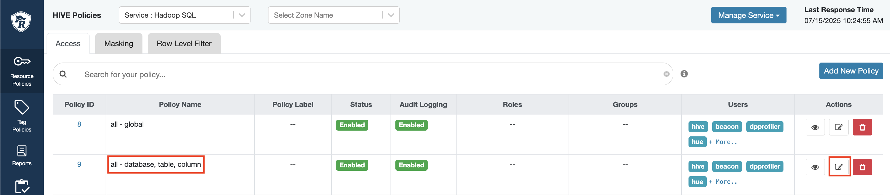
+
- In the *Users* section, add `dataviz` to the list.
- Scroll down and click *Save*.

=== 12. Import Dashboard into DataViz

- Go to *Cloudera DataViz*.  
  You can access the DataViz UI using the default admin credentials:  
  `vizapps_admin / vizapps_admin`.

- Navigate to the *Data* tab, then click on *Import visual artifacts*.
+
image::../images/import_visual.png[Import Visual]
+
- Upload the dashboard JSON file: https://github.com/cloudera/cloudera-partners/blob/project-axon/Project-Axon/project_axon_dashboard.json[project_axon_dashboard.json].
- After uploading, click on *Accept and Import*, you will see an *Import Successful* message along with the list of datasets that were imported as part of the dashboard.
+
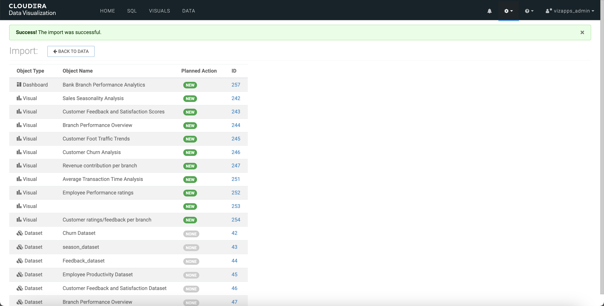
+
- Once imported, navigate to the *Visuals* tab and click on the dashboard to open and view it.
+
image::../images/dashboard.png[dashboard]

=== 13. Accessing DataViz as Individual Users

To allow multiple users to view or interact with dashboards, follow the steps below to create individual user accounts in Cloudera DataViz:

==== Step 1: Log in as Admin

- Open the DataViz from the base cluster.
- Log in using the default admin credentials:
+
[source,text]
----
Username: vizapps_admin
Password: vizapps_admin
----

==== Step 2: Create a New User

- Once logged in, navigate to the settings icon and click on **Users and Groups**.
- Click on the **New User** button.
+
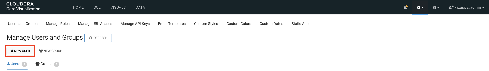

==== Step 3: Fill in User Details

- Enter the required details:
  * `Username`: (e.g., `jdoe`)
  * `Full Name`: (e.g., `John Doe`)
  * `Password`: Set a secure password for the user
- Assign appropriate permissions:
  * For **read-only access**, select the **Visual Consumer** role.
  * Other roles include **System Admin**, **Database Admin**, and **Analyst**, depending on the level of access needed.
+
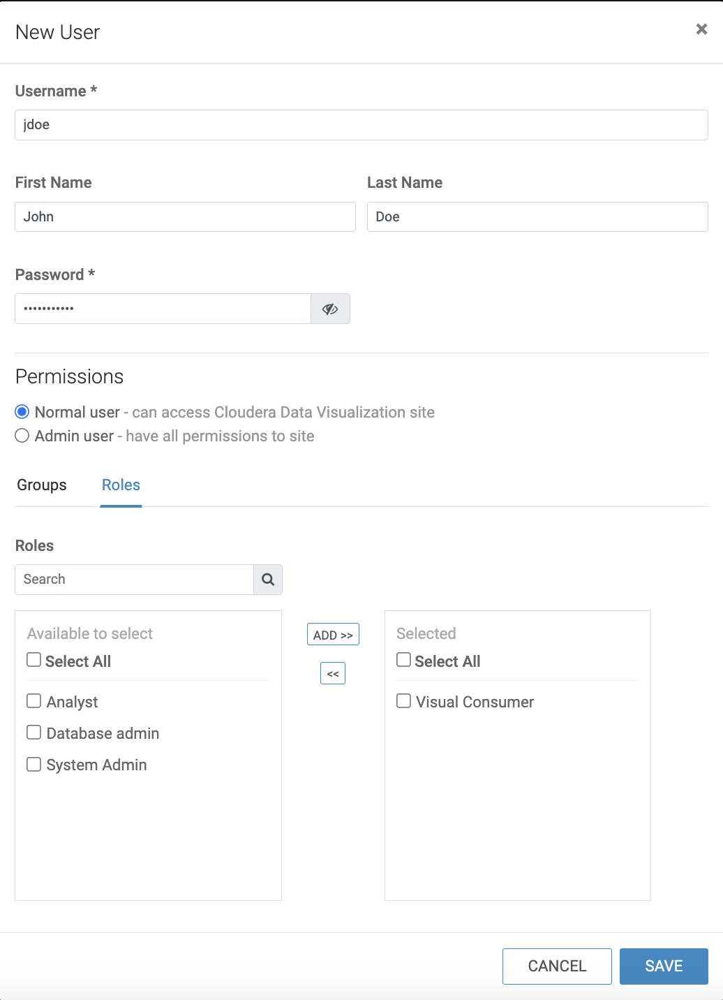

==== Step 4: User Logs In

- The newly created user can now log in to DataViz using the credentials provided.
- Depending on their role, they will have access to view, edit, or manage dashboards and datasets.

== Contact

For questions, feedback, or demo support, please reach out to the **Partner Solutions Engineering** team at Cloudera.
